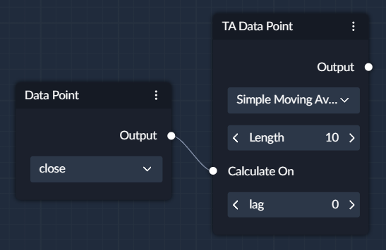
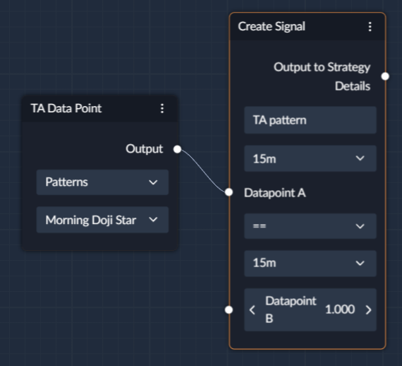

## What is a Technical Analysis (TA) Data Point?

TA data point allows you to use traditional technical analysis indicators, such as Moving Averages, Relative Strength
Index, Average True Range and many more! 

Most of the traditional TA indicators require an input such as Closing price which is used to compute an indicator, 
so you only need to attach the Data Point with **close** or _any_ of the other datapoints, and you will get your indicator. 

Like this:
 

In addition, you can also choose from a selection of common candlestick patterns such as Hanging Man, Morning Star, and 
others. These would return 1 when the system detects the formation that you've selected and 0 when there is no such formation.
To use Candlestick patterns as a signal - simply choose the pattern you want in the TA Node, attach it to the Create Signal
Node, and in the comparison operator choose **==** and for the Datapoint B choose **1**.

---

## Available Indicators

### Awesome Oscillator (AO)

### Absolute Price Oscillator (APO)
The Absolute Price Oscillator (APO) is based on the absolute differences between two moving averages of different lengths,
a 'Fast' and a 'Slow' moving average. The APO is the difference between the Fast and Slow moving averages.

### Bias

### Balance of Power

### Commodities Channel Index (CCI)

### Chande Momentum Oscillator (CMO)

### Center of Gravity

### Chande Momentum Oscillator (CMO)

### Coppock Curve
Coppock Curve (originally called the "Trendex Model") is a momentum indicator
is designed for use on a monthly time scale.  Although designed for monthly
use, a daily calculation over the same period can be made, converting the
periods to 294-day and 231-day rate of changes, and a 210-day weighted
moving average.

### Correlation Trend Indicator (CTI)
The Correlation Trend Indicator is an oscillator created by John Ehler in 2020.
It assigns a value depending on how close prices in that range are to following
a positively- or negatively-sloping straight line. Values range from -1 to 1.
This is a wrapper for ta.linreg(close, r=True).

### Efficiency Ratio
The Efficiency Ratio was invented by Perry J. Kaufman and presented in his book "New Trading Systems and Methods". It is designed to account for market noise or volatility.
It is calculated by dividing the net change in price movement over N periods by the sum of the absolute net changes over the same N periods.

### Fisher Transform
Attempts to identify significant price reversals by normalizing prices over a
user-specified number of periods. A reversal signal is suggested when the the
two lines cross.

### KDJ Indicator
The KDJ indicator is actually a derived form of the Slow
Stochastic with the only difference being an extra line
called the J line. The J line represents the divergence
of the %D value from the %K. The value of J can go
beyond [0, 100] for %K and %D lines on the chart.

### Know Sure Thing
The 'Know Sure Thing' is a momentum based oscillator and based on ROC.

### MACD
The MACD is a popular indicator to that is used to identify a security's trend.
While APO and MACD are the same calculation, MACD also returns two more series
called Signal and Histogram. The Signal is an EMA of MACD and the Histogram is
the difference of MACD and Signal.

### Momentum
Momentum is an indicator used to measure a security's speed (or strength) of
movement. Or simply the change in price.

### Pretty Good Oscillator (PGO)
The Pretty Good Oscillator indicator was created by Mark Johnson to measure the distance of the current close from its N-day Simple Moving Average, expressed in terms of an average true range over a similar period. Johnson's approach was to
use it as a breakout system for longer term trades. Long if greater than 3.0 and
short if less than -3.0.

### Percentage Price Oscillator
The Percentage Price Oscillator is similar to MACD in measuring momentum.

### Psychological Line
The Psychological Line is an oscillator-type indicator that compares the
number of the rising periods to the total number of periods. In other
words, it is the percentage of bars that close above the previous
bar over a given period.

### Percentage Volume Oscillator
Percentage Volume Oscillator is a Momentum Oscillator for Volume.

### Rate of Change
Rate of Change is an indicator is also referred to as Momentum (yeah, confusingly).
It is a pure momentum oscillator that measures the percent change in price with the
previous price 'n' (or length) periods ago.

### Relative Strength Index (RSI)
The Relative Strength Index is popular momentum oscillator used to measure the
velocity as well as the magnitude of directional price movements.

### Relative Strength Extra
The Relative Strength Xtra is based on the popular RSI indicator and inspired
by the work Jurik Research. The code implemented is based on published code
found at 'prorealcode.com'. This enhanced version of the rsi reduces noise and
provides a clearer, only slightly delayed insight on momentum and velocity of
price movements.

### Relative Vigor Index
The Relative Vigor Index attempts to measure the strength of a trend relative to
its closing price to its trading range.  It is based on the belief that it tends
to close higher than they open in uptrends or close lower than they open in
downtrends.

### Slope
Returns the slope of a series of length n. Can convert the slope to angle.

### SMI Ergodic Indicator
The SMI Ergodic Indicator is the same as the True Strength Index (TSI) developed
by William Blau, except the SMI includes a signal line. The SMI uses double
moving averages of price minus previous price over 2 time frames. The signal
line, which is an EMA of the SMI, is plotted to help trigger trading signals.
The trend is bullish when crossing above zero and bearish when crossing below
zero. This implementation includes both the SMI Ergodic Indicator and SMI
Ergodic Oscillator.

### Schaff Trend Cycle
The Schaff Trend Cycle is an evolution of the popular MACD incorportating two
cascaded stochastic calculations with additional smoothing.

### Stochastic Oscillator
The Stochastic Oscillator (STOCH) was developed by George Lane in the 1950's.
He believed this indicator was a good way to measure momentum because changes in
momentum precede changes in price.

### Stochastic RSI
Stochastic RSI and Dynamic Momentum Index was created by Tushar Chande and Stanley Kroll and published in Stock & Commodities V.11:5 (189-199)

### TD Sequential
Tom DeMark's Sequential indicator attempts to identify a price point where an
uptrend or a downtrend exhausts itself and reverses.

### Trix
The TRIX is a momentum oscillator as it effectively filters out price movements and identify divergences.

### True Strength Index
The True Strength Index is a momentum indicator used to identify short-term
swings while in the direction of the trend as well as determining overbought
and oversold conditions.

### Ultimate Oscillator
The Ultimate Oscillator is a momentum indicator over three different
periods. It attempts to correct false divergence trading signals

### Willian % R
William's Percent R is a momentum oscillator similar to the RSI that
attempts to identify overbought and oversold conditions.

## Moving Averages

### Arnaud Legoux Moving Average
The ALMA moving average uses the curve of the Normal (Gauss) distribution, which
can be shifted from 0 to 1. This allows regulating the smoothness and high
sensitivity of the indicator. Sigma is another parameter that is responsible for
the shape of the curve coefficients. This moving average reduces lag of the data
in conjunction with smoothing to reduce noise.

### Double Exponential Moving Average
The Double Exponential Moving Average attempts to a smoother average with less
lag than the normal Exponential Moving Average (EMA).

### Exponential Moving Average
The Exponential Moving Average is more responsive moving average compared to the
Simple Moving Average (SMA).  The weights are determined by alpha which is
proportional to it's length.  There are several different methods of calculating
EMA.  One method uses just the standard definition of EMA and another uses the
SMA to generate the initial value for the rest of the calculation.

### Fibonacci's Weighted Moving Average
Fibonacci's Weighted Moving Average is similar to a Weighted Moving Average
(WMA) where the weights are based on the Fibonacci Sequence.

### Gann High Low Activator
The Gann High Low Activator Indicator was created by Robert Krausz in a 1998
issue of Stocks & Commodities Magazine. It is a moving average based trend
indicator consisting of two different simple moving averages.

### Hull Exponential Moving Average
The Hull Exponential Moving Average attempts to reduce or remove lag in moving averages.

### Holt Winter Moving Average
Indicator HWMA (Holt-Winter Moving Average) is a three-parameter moving average
by the Holt-Winter method; the three parameters should be selected to obtain a
forecast

### Jurik Moving Average
Mark Jurik's Moving Average (JMA) attempts to eliminate noise to see the "true"
underlying activity. It has extremely low lag, is very smooth and is responsive
to market gaps.

### Kaufman Adaptive Moving Average
Developed by Perry Kaufman, Kaufman's Adaptive Moving Average (KAMA) is a moving average
designed to account for market noise or volatility. KAMA will closely follow prices when
the price swings are relatively small and the noise is low. KAMA will adjust when the
price swings widen and follow prices from a greater distance. This trend-following indicator
can be used to identify the overall trend, time turning points and filter price movements.

### Linear Regression Moving Average
Linear Regression Moving Average. This is a simplified version of a
Standard Linear Regression. LINREG is a rolling regression of one variable. A
Standard Linear Regression is between two or more variables.

### McGinley Dynamic Indicator
The McGinley Dynamic looks like a moving average line, yet it is actually a
smoothing mechanism for prices that minimizes price separation, price whipsaws,
and hugs prices much more closely. Because of the calculation, the Dynamic Line
speeds up in down markets as it follows prices yet moves more slowly in up
markets. The indicator was designed by John R. McGinley, a Certified Market
Technician and former editor of the Market Technicians Association's Journal
of Technical Analysis.

### Midpoint
The Midpoint is the average of the high and low prices.

### Midpoint Price

### Pascal Moving Average
Pascal's Weighted Moving Average is similar to a symmetric triangular window
except PWMA's weights are based on Pascal's Triangle.

### Wilder's Moving Average
The WildeR's Moving Average is simply an Exponential Moving Average (EMA) with
a modified alpha = 1 / length.

### Sine Weighted Moving Average
A weighted average using sine cycles. The middle term(s) of the average have the
highest weight(s)

### Simple Moving Average
The Simple Moving Average is the classic moving average that is the equally
weighted average over n periods.

### T3 Moving Average
Tim Tillson's T3 Moving Average is considered a smoother and more responsive
moving average relative to other moving averages.

### Triple Exponential Moving Average
A less laggy Exponential Moving Average.

### Triangular Moving Average
A weighted moving average where the shape of the weights are triangular and the
greatest weight is in the middle of the period.

### Variable Index Dynamic Average
Variable Index Dynamic Average (VIDYA) was developed by Tushar Chande. It is
similar to an Exponential Moving Average but it has a dynamically adjusted
lookback period dependent on relative price volatility as measured by Chande
Momentum Oscillator (CMO). When volatility is high, VIDYA reacts faster to
price changes. It is often used as moving average or trend identifier.

### Volume Weighted Moving Average
The Volume Weighted Moving Average is similar to a Simple Moving Average, but it is weighted based on the volume of each period.

### Weighted Closing Price
Weighted Closing Price is the weighted price given: high, low and double the close.

### Weighted Moving Average
The Weighted Moving Average where the weights are linearly increasing and
the most recent data has the heaviest weight.

### Zero Lag Exponential Moving Average
The Zero Lag Moving Average attempts to eliminate the lag associated with moving averages.  This is an adaption created by John Ehler.

### Average Directional Movement Index
Average Directional Movement is meant to quantify trend strength by measuring
the amount of movement in a single direction.

### Aroon and Aroon Oscillator
Aroon attempts to identify if an asset is trending and how strong.

**### Chopponess Index**
The Choppiness Index was created by Australian commodity trader
E.W. Dreiss and is designed to determine if the market is choppy
(trading sideways) or not choppy (trading within a trend in either
direction). Values closer to 100 implies the underlying is choppier
whereas values closer to 0 implies the underlying is trending.

### Parabolic Stop and Reverse
Parabolic Stop and Reverse (PSAR) was developed by J. Wells Wilder, that is used
to determine trend direction and it's potential reversals in price. PSAR uses a
trailing stop and reverse method called "SAR," or stop and reverse, to identify
possible entries and exits. It is also known as SAR.

### Qstick
The Q Stick indicator, developed by Tushar Chande, attempts to quantify and
identify trends in candlestick charts.

### Vertical Horizontal Filter
VHF was created by Adam White to identify trending and ranging markets.

### Vortex Indicator
Two oscillators that capture positive and negative trend movement.

## Volatility Indicators

### Acceleration Bands
Acceleration Bands created by Price Headley plots upper and lower envelope
bands around a simple moving average.

### Average True Range
The Average True Range is a measure of volatility caused by gaps or limit moves. introduced by Welles Wilder

### Bollinger Bands
Bollinger Bands are a volatility indicator that consists of a Moving Average and two standard deviations band.

### Donchian Channel
The Donchian Channel is an indicator used in market trading developed by Richard Donchian. It is formed by taking the highest high and the lowest low of the last n periods.

### Keltner Channel
The Keltner Channel is a volatility-based indicator that makes use of the average true range to set the channel distance above and below an exponential moving average.

### Mass Index
The Mass Index was developed by Donald Dorsey. It predicts a reversal in the current trend when the Mass Index drops below 27 and then rises above 26.

### Normalized Average True Range
The Normalized Average True Range is a volatility indicator introduced by Welles Wilder.

### Price Distance
Price Distance is the difference between the high and low prices.

### Elders Thermometer
The Elder Thermometer is a volatility indicator that attempts to measure the strength of a trend.

### True Range
The True Range is the greatest of the following: the current high less the current low, the absolute value of the current high less the previous close and the absolute value of the current low less the previous close.

### Ulcer Index
The Ulcer Index by Peter Martin measures the downside volatility with the use of the Quadratic Mean, which has the effect of emphasising large drawdowns.

## Volume Indicators

### Accumulation Distribution Line
The Accumulation Distribution Line is a cumulative indicator that uses volume and price to assess whether a stock is being accumulated or distributed.

### Chaikin Money Flow
The Chaikin Money Flow is an oscillator that measures buying and selling pressure for a security.

### Elders Force Index
The Elder Force Index is an oscillator that attempts to identify the force or strength of a move.

### Trend Force Index
The Trend Force Index is a volume-based indicator that combines price and volume to assess the power behind a trend.

### Ease of Movement
The Ease of Movement indicator was developed by Richard W. Arms, Jr. It is a volume-based oscillator that fluctuates above and below the zero line.

### Klinger Volume Oscillator
This indicator was developed by Stephen J. Klinger. It is designed to predict
price reversals in a market by comparing volume to price.

### Money Flow Index
Money Flow Index is an oscillator indicator that is used to measure buying and
selling pressure by utilizing both price and volume.

### Negative Volume Index
The Negative Volume Index is a cumulative indicator that uses volume change in
an attempt to identify where smart money is active.

### On Balance Volume
On Balance Volume is a running total of volume. It shows if volume is flowing

### Positive Volume Index
The Positive Volume Index is a cumulative indicator that uses volume change in
an attempt to identify where smart money is active.

### Price Volume Trend
Price Volume Trend is a cumulative volume-based indicator that combines percentage price change and volume.

## Other Indicators

### Hurst Exponent
The Hurst Exponent is used to differentiate between a random walk and a trending series.

| Input       | Default | Description                  |
|:------------|:--------|:-----------------------------|
| `Length`    | 20      | Window Period                |

| Output Example | Type  | Description                                                                |
|:---------------|:------|:---------------------------------------------------------------------------|
| `0 to 1`       | Float | A Hurst exponent value between 0.5 and 1.0 indicates persistent behavior, 0 and 0.5 is indicative of anti-persistent behavior |

---

### Hurst RS
The Hurst Rescaled range is a measure of the relative strength of the Hurst Exponent.

| Input       | Default | Description                  |
|:------------|:--------|:-----------------------------|
| `Length`    | 20      | Window Period                |

| Output Example | Type  | Description                                                                |
|:---------------|:------|:---------------------------------------------------------------------------|
| `0 to 1`       | Float | A Hurst exponent value between 0.5 and 1.0 indicates persistent behavior, 0 and 0.5 is indicative of anti-persistent behavior |

---

### Times UP/Down
Calculates the number of consecutive up OR down candles.

| Input Example            | Default  | Type      | Description                                            |
|:-------------------------|:---------|:----------|:-------------------------------------------------------|
| `Times Up or Times Down` | Times Up | Drop Down | Whether to return the number of Times Up or Times Down |

| Output Example | Type    | Description                                                                                                            |
|:---------------|:--------|:-----------------------------------------------------------------------------------------------------------------------|
| `3`            | Integer | If there has been 3 green candles in a row, it would return 3 if Times Up is selected, but 0 if Times Down is selected |

---

### Times Up Down Ratio
Calculates the ratio of consecutive up and down candles.

| Input       | Default | Description                  |
|:------------|:--------|:-----------------------------|
| `Length`    | 20      | Window Period                |

| Output Example | Type  | Description                                                                                                            |
|:---------------|:------|:-----------------------------------------------------------------------------------------------------------------------|
| `0.65`         | Float | If your `Length` is `10`, and there have been 6 green candles and 4 red candles, it would return `0.6` |

---

### VIX

The VIX is a measure of market expectations of near-term volatility conveyed by S&P 500 stock index option prices.

| Input       | Default | Description                  |
|:------------|:--------|:-----------------------------|
| `Length`    | 20      | Window Period                |
| `Duration`  | 252     | 252 (Trading Days per year)  |

---

### Candlestick Patterns
{ align=right }

- Hanging Man
- Bearish Harami
- Bullish Harami
- Grave Stone Doji
- Dark Cloud Cover
- Doji
- Doji Star
- Dragonfly Doji
- Bearish Engulfing
- Bullish Engulfing
- Hammer
- Inverted Hammer
- Morning Doji Star
- Piercing Pattern
- Rain Drop
- Rain Drop Doji
- Star
- Shooting Star
