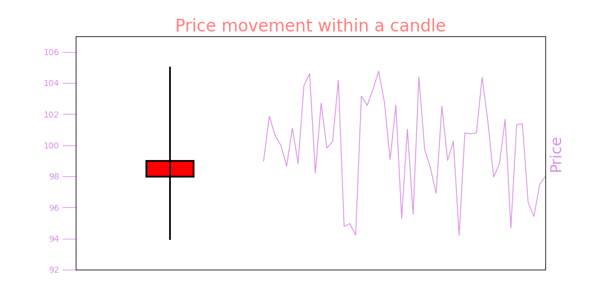

## Backtesting Engine

TLDR

* Backtest runs on aggregated trades at 1 millisecond resolution
* This allows us to process multiple strategy actions at the same candle
  * ie you can open position, add to position and close the position after several take profits on the same candle
* Knowing how much time it takes for us and for the exchange to process your orders, we add this delay to the backtest simulating slippage
* Your order size cannot be more than 40% of the recorded candle volume to prevent too unrealistic trades

#### Overview of how our Backtesting Engine works

The backtest runs on the "OHLCV candles" data until any single or multiple of the conditions created by the user are triggered. 
Once the condition(s) are met, the engine goes to the trades data aggregated at 1 millisecond resolution to identify in 
which order the conditions are triggered and executes all actions in that order. This allows our engine to execute 
multiple different actions in a single candle and at the realistic price of execution rather than just at the 
candle closing price. This is especially important for the cases when volatility is high in which cases you might execute 
multiple take profits at the same candle or, for example, open the trade, execute take profit and then exit with a stop loss.

Below is a made up example of how price might move within a single candle during high volatility, and for your backtests
to be accurate it is important to know which prices were hit first which might radically change performance of your strategy.

Further, to make the backtests more accurate, we add a delay to the execution price to simulate slippage because we know 
how much time it takes us to process the order of the user and how much time it takes for the exchange to process the 
order we send to it on behalf of the user. Again, during periods of high volatility, price might change quickly
in a matter of milliseconds, so the slippage helps to simulate that.

The engine considers the volume in the candle when making the trades to avoid issues in the backtests, when volume executed
by the strategy is greater than the volume recorded in the candle, which is an indication that the price would've moved a lot
if the order were to take place. To account for that the engine doesn't allow to make trades that are greater than 40% 
of the volume recorded in the given candle. This is especially important for the cases when you backtest on assets with
very low liquidity where relatively small trade size might significantly affect the price
