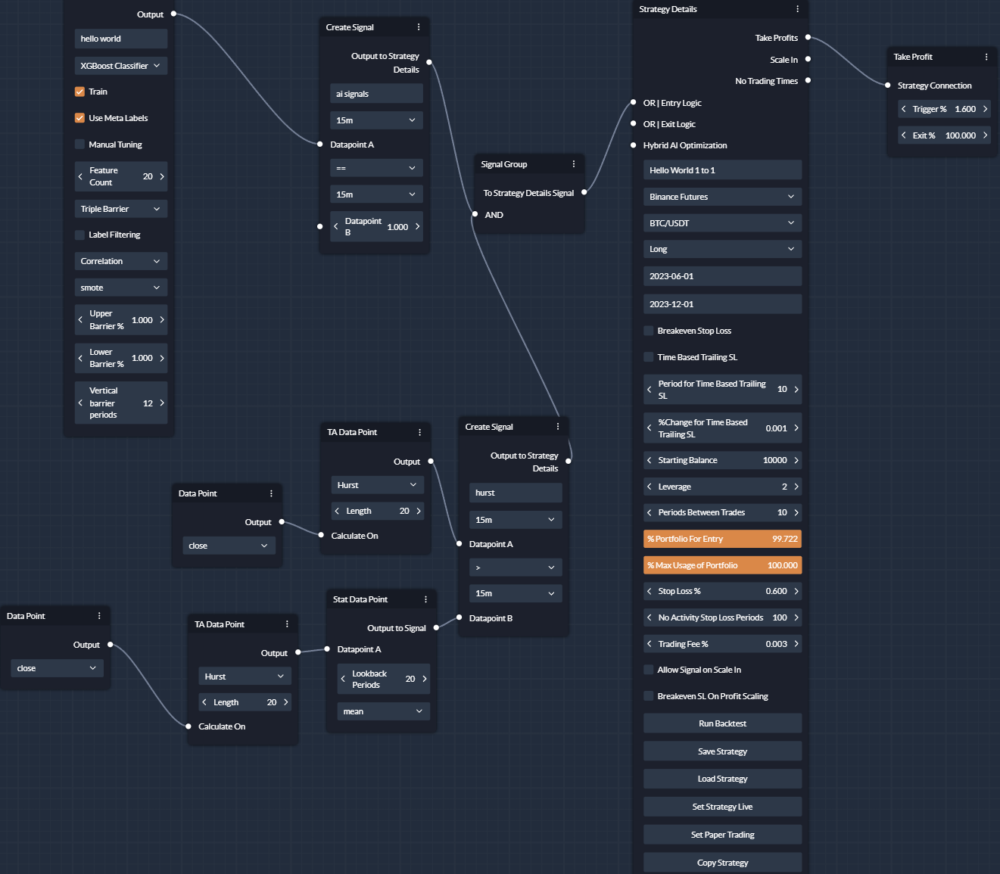
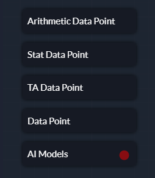
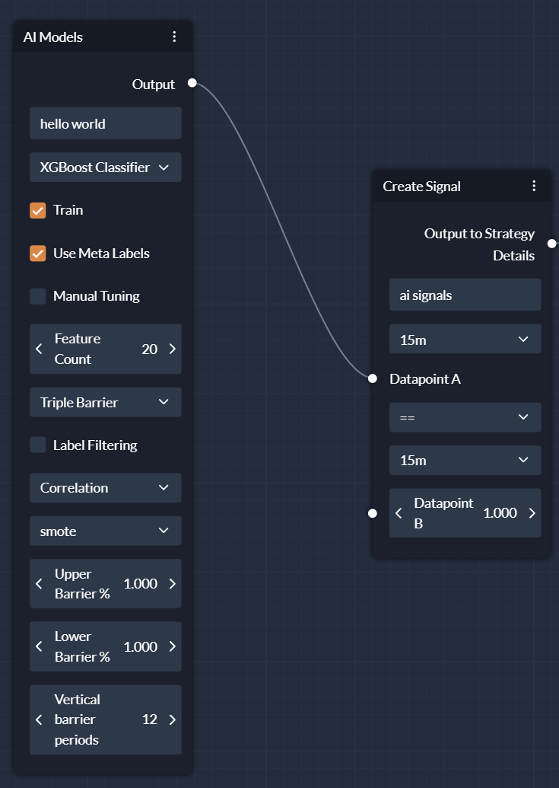
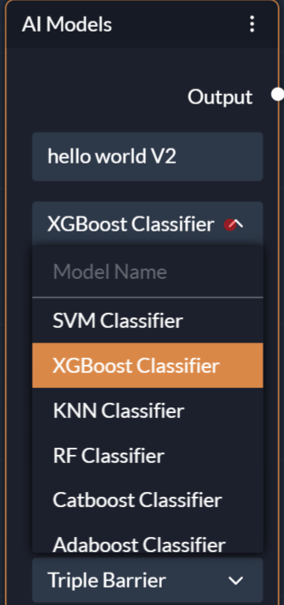
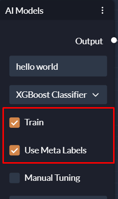
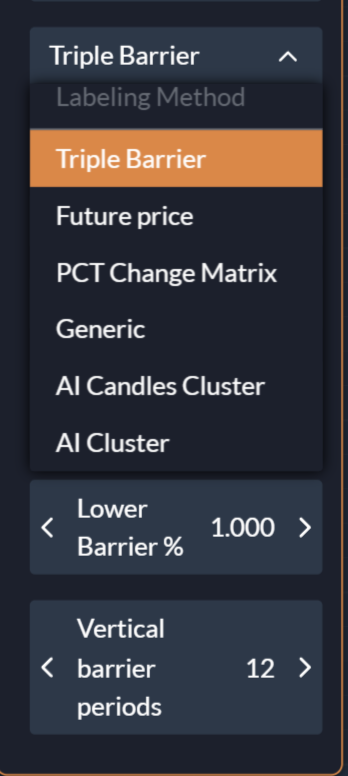
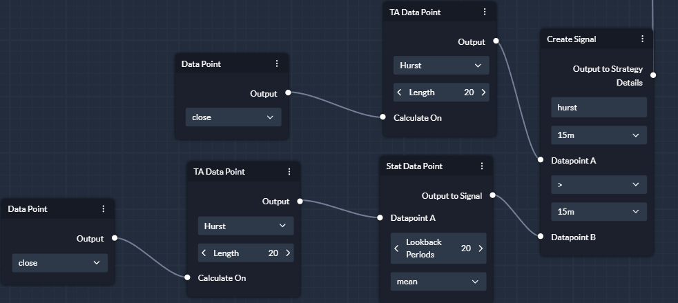
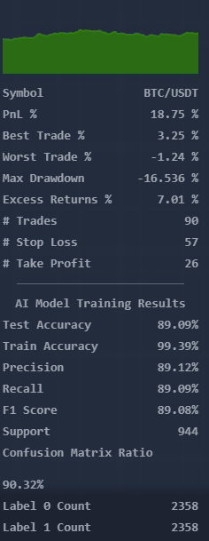

# Building Your First  AI Strategy
A snapshot overview of the AI Strategy that we will be building in this guide, i'll walk you through the steps on how to build it. 
 

## Bring up the AI Model card

First click on the "AI Models" on the left hand side of the screen to bring up the AI card. for reference for the attributes of the AI Model click [here](/data_nodes/AI_Models/)

some important things to note is the AI models will default to a side based on the option you have selected in the strategy details. if long is selected the model will only execute long and vice versa. 
By default the AI models will optimize themselves automatically so you won't have to input parameters by yourself, however you can enable the manual training option to set your desired parameters. 

 

## Step 1: Select AI Model
Once you have dragged and dropped the AI Model node onto the canvas, you can select the AI Model you want to use. In this example, we will use a classifier model called XGBoost, each model has their own advantages/weaknesses so do take time to research them or experiement with the different models. 

 

## Step 2: Enabling training and meta labelling
If we don't set the training to true, the AI model will not be trained, it will attempt to load an existing one if it exists which will look for the model name and timeframe being used. be aware this can overwrite existing models if the same name and timeframe is used.
Meta labelling allows us to retrain the model after being trained, this aims to improve the performance for correcting for bad predictions within our test dataset.

 

## Step 3: Selecting the AI Model Parameters
Since we're training we will set the parameters on which to train on, the labelling method we will use is tripple barrier with the default settings but this can be easily configured as desired with a variety of other options avalible to be used.

I opted to use 20 features, this number can be adjusted freely but can also be overwrittern by feature selection methods and specific models that optimize for number of features used.

Label filtering is an option that aims to further refine labels generated by labelling methods to ensure winning/losing trades are more accurately classified but uses different metrics.

For feature selection I used correlation based feature selection, which aims to select highly correlated features to the target training labels.
Finally I selected my class balancing method, in this case I used the SMOTE method to balance the classes of the training labels, this aims to make the minority labels be equal to the majority labels

 

## Step 3.5 (Optional): Using TA Data Points
If you want to use TA data points to further refine your AI model, you can drag and drop the TA Data Point node onto the canvas and connect it with its required datapoints and signal creation.
I decided to use the hurst exponent to only allow the mode to execute trades when the hurst exponent is above the mean within a 20 period window. 

 

## Step 4: Run the backtest and interpret the metrics
Once we're happy with our settings for our AI model and connect all our nodes together we can run the backtest. Once it's finished training on the left hand side of the screen we will be able to see metrics of our test.

Classifers will return the following metrics test accuracy, train accuracy, precision, recall, f1 score, support, confusion amtrix ratio, label 0 count, label 1 count

Regressors will return the following metrics, MSE, MAE and Rsquared

Refer to AI Model documentation for more information on the metrics returned by the AI model.

An important consideration is to ensure that the model is not overfitting this can be detected if the train accuracy is 1.0 and usually suggests the model is overfitting to the training data. Otherwise once you have a model you're happy with you can refine it with risk management or adding other controls

 
