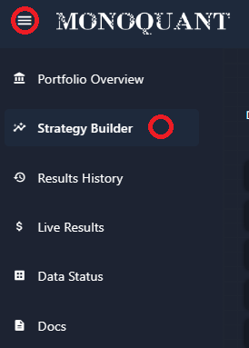
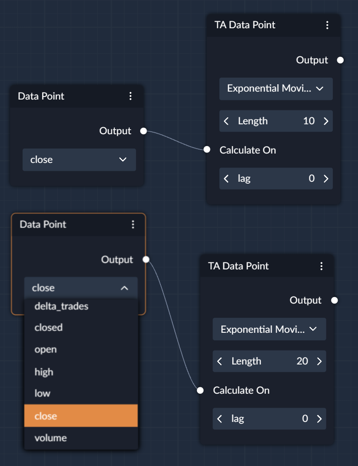
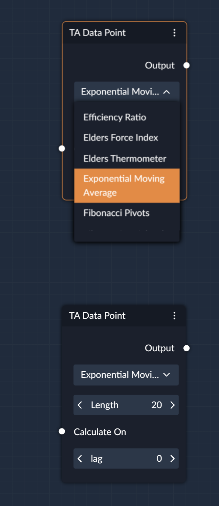
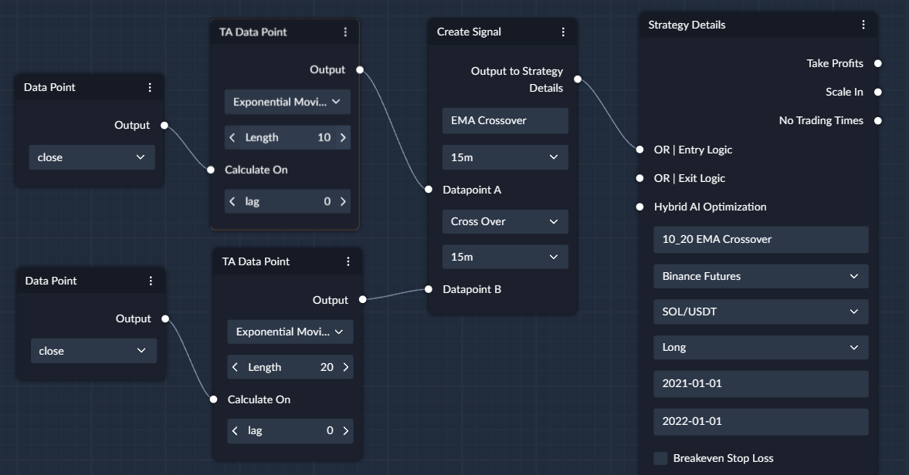
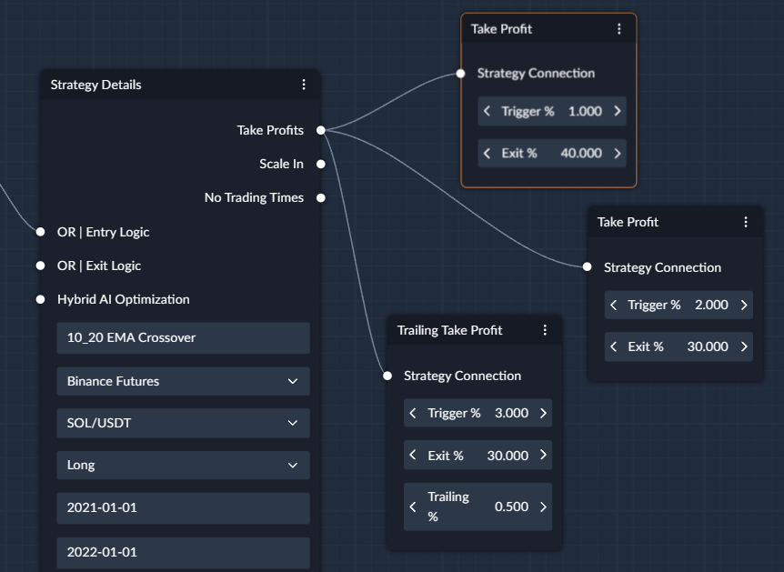
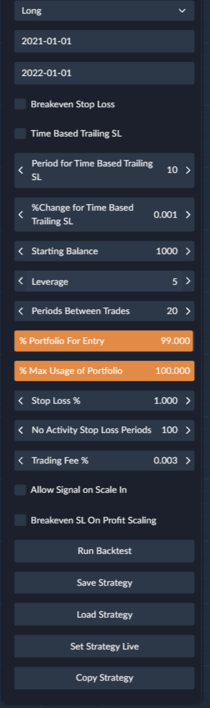
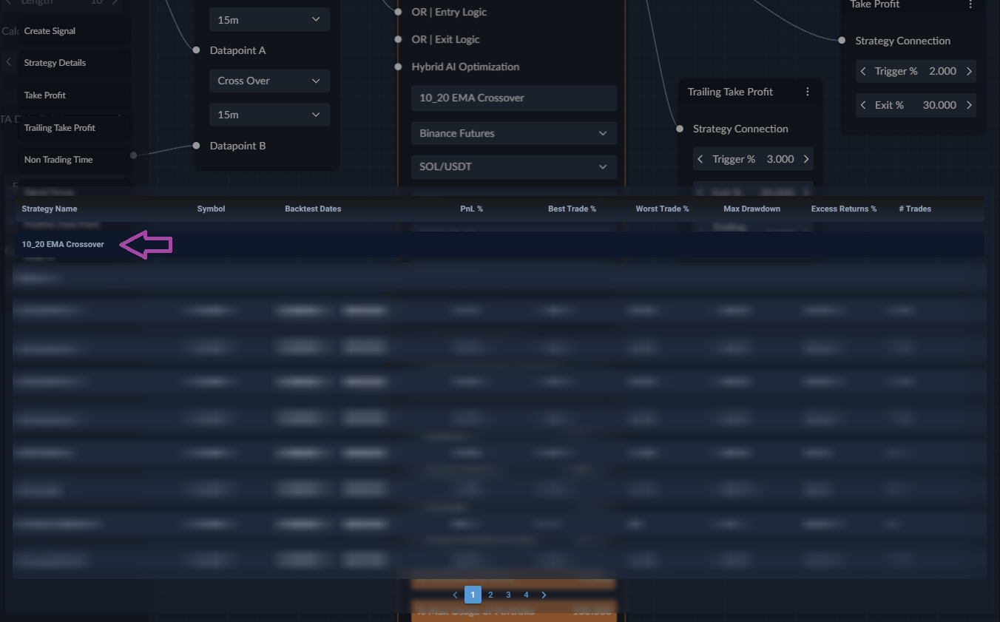
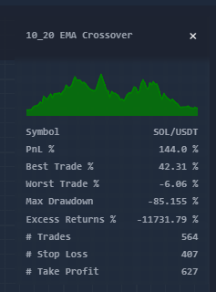

## Building Your First Strategy

To start creating your trading strategies, just navigate to the Strategy Builder tab on the website, and the canvas with the
[Strategy Details](/docs/strategy_nodes/Strategy_Details.md) node will pop up. You can use any amount of space on the 
canvas to easily bring all of your ideas to life.

Firstly, you'll need to give your strategy a unique name (you don't want your awesome strategy to be overwritten with 
another one you prototype quickly, right?), and select exchange (ie Binance-Futures), trading symbol (ie BTC/USDT), 
strategy direction (Long or Short), and time period you want to run the strategy on (2023-01-01 - 2024-01-01).

Now we can get to the fun part and start prototyping our strategy! We can start with something simple, such as an EMA 
crossover strategy. For this strategy, we need 2 exponential moving average (EMA) indicators with different averaging values 
(slow and fast) and then we will be able to get a signal when fast moving average crosses slow moving average upwards. 

### Define Entry Signal

Exponential Moving Averages we can find in the [TA Data Point](/docs/data_nodes/TA_Data_Point.md), and 
since we need 2 of those, we just need to drag and drop 2 TA Data Points on the left side of the Strategy Details. In 
TA nodes we now need to select "Exponential Moving Average" in the top dropdown section. Then we need to select the period 
for the Fast EMA (let's try 10) and for the Slow EMA (let's try 20). The TA nodes have an input field indicated by the 
white dot with "Calculate On" name. This allows you to select on which data you want your TA indicator to be calculated.
For EMA crossover candle close price is the most common choice, so let's stick with it. Now we will need 2 Data Point 
Nodes which will allow us to select candle "close" price.  

|  |  |
|--------------------------------------------------------------------------------------|-----------------------------------------------------------------------------------|

Now that we have our Moving Averages, all we need to do is get a signal out of them, and we can do this with the 
[Create Signal](/docs/strategy_nodes/Create_Signal.md) node. Drag and drop Create Signal node on the right side of the TA Data Points, so we can pass TA
indicators into the Create Signal like so: 

In the Create Signal node, we can give a name to our signal, then we need to select "Cross Over" as a comparison 
operator which will look for cases when Datapoint A crosses Datapoint B from the below upwards. Next, we need to choose 
the time frames we want to use for both TA nodes (ie 15 minutes), and attach the Create Signal node to the 
"OR | Entry Logic" of Strategy Details. 

### Define Exits

Now that our entries are sorted, we can create Take Profits. We can start with 3 Take Profits (2 standard take profits 
and one Trailing Take Profit), and see how frequently they get hit. For example, we can do take profits at 1%, 2% and 3%
for the [trailing take profit](/docs/strategy_nodes/Trailing_Take_Profit.md) with 0.5% trailing scaling out of trade by 
40%, 30% and 30%.

Now we need to define our stop loss to make sure we don't stay in a losing trade for too long, which we can do in the 
Strategy Details Node - let's set it to 1% for now. 

### Additional Settings

Now we just need to finalise our settings in the Strategy Details node:
* set our `Starting Balance` to $1,000
* set `Leverage` to 5 (this would allow us to use 5x of our balance to enter into the trades, so $5,000)
* set `Periods Between Trades` to **20** - this means that after we entered into a trade on our signal, with 15m Time 
  the next entry can be done only after 20 periods of the minimum Time Frame we use pass. In our case we use 2 TA indicators 
  Frames, so if we entered into a trade at 13:00, the next time we can enter into a trade would be 
  13:00 + 15m * **20** = 18:00
* _use 99% of our `% Portfolio For Entry` because we want to have some spare funds to cover commissions and funding fees_
* `% Max Usage of Portfolio` could be set to 100%. This means that the system would allow us to use our **balance** * 
  **leverage** which is $5,000 when we start the backtest
* `No Activity Stop Loss Periods` we can leave at 100. This setting uses the same logic regarding how many periods on 
  the minimum Time Frame should pass as `Periods between Trades`. The settings means that the position will be closed 
  after 100 periods pass.

### Run Backtest

That's it! Now we just need to click on the `Save Strategy` button, after that you can click on `Load Strategy` and you
will see your saved strategy in the popped up screen:

The fields are not populated because we didn't run a backtest yet, and once we do, the fields will be populated with the
result of the latest backtest we ran for this strategy name. Now click on the `Run Backtest` button to start the 
backtest execution.

In the top right part of the Strategy Builder where your notifications pop up, once your backtest finished, you should 
see simplified backtest results: 

While, we can see that the strategy achieved 144% PnL over the backtested period, we can also see that our Excess 
Returns are **-** 11,731.79% meaning we would've made significantly more if we just bought SOL and held. This
tells us that this strategy is very bad but can YOU come up with a better strategy? Or even improve the one we build 
together here?

!!! warning "Important"
      
    When creating strategies, always be mindful of overfitting (adapting your parameters to historical price movements),
    long losing streaks (can your strategy and/or you survive a long losing streak when you go live?), outliers (these 
    1-2 trades that made most of returns in your strategy might not happen when you go live).

[//]: # (Also, check out our guide on [Understanding Backtest Results]&#40;Understanding_backtest_results.md&#41; )

[//]: # (And check out our [Tips on Creating Good Strategies](Tips_on_creating_good_strategies.md))

