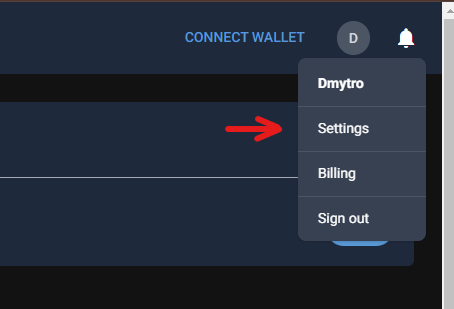
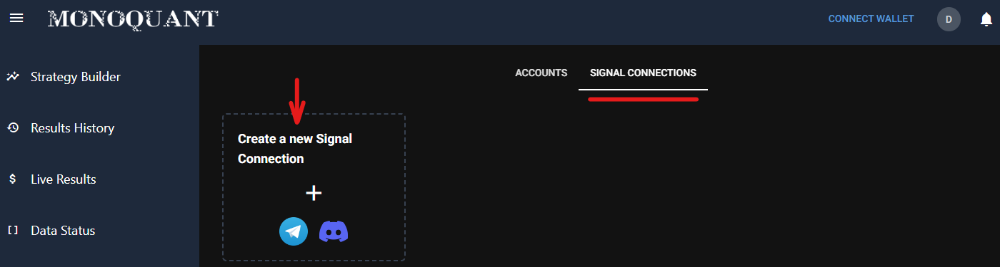
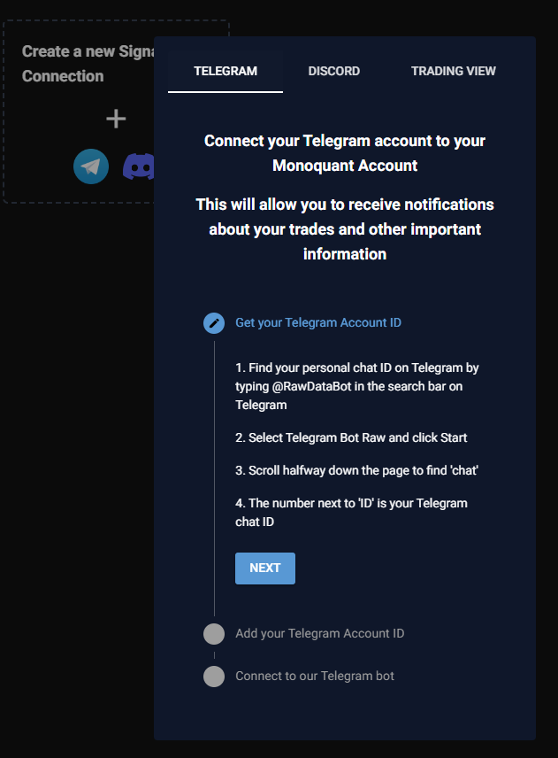
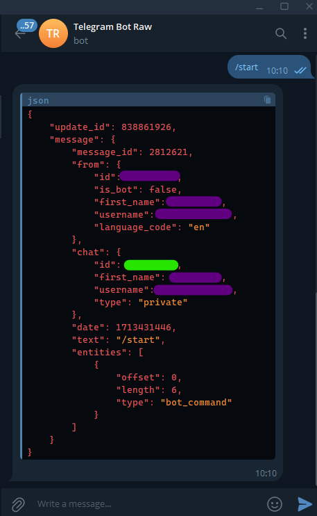
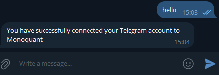
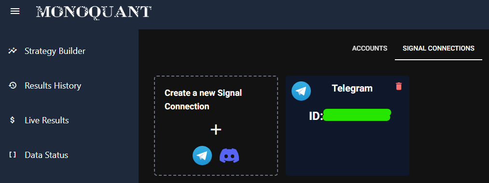
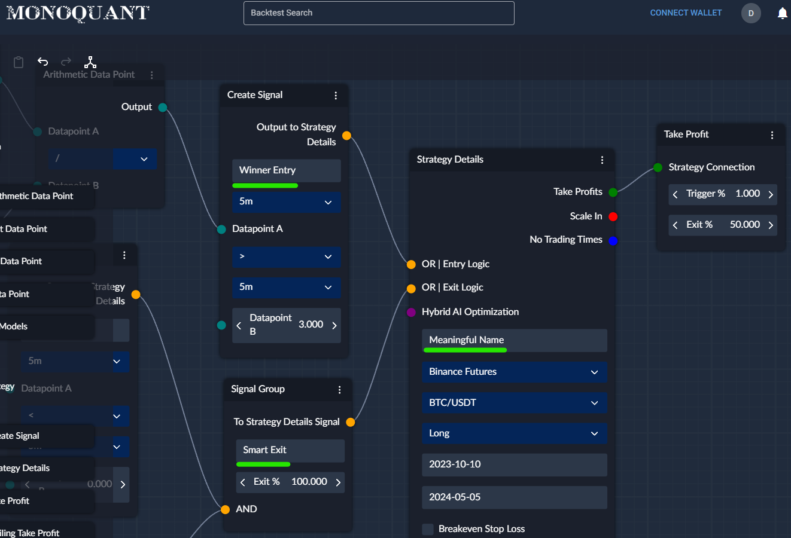
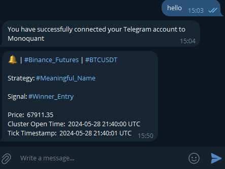

## Setup Telegram Notifications

Connect your Telegram account to receive notifications about: 
* signals from your strategies
* updates on your paper and live trades
* relevant news about the platform

### Steps to connect Telegram: 
1. go into the Settings tab located in the dropdown under your account widget
1. select the Signal Connections tab
1. click on "Create a new Signal Connection"
1. follow the instructions in the pop-up

After following the instructions you should receive a Telegram notification from the platform
indicating that you are done!

### For those preferring visual steps:

1. 
1. 
1. 
1. 
1. 
1. 

That's it! You are all done.

To make the most out of connecting your Telegram to the platform, make sure to create meaningful names
for your signals and strategies so that monitoring is a breeze for you!

Then you would be able to receive notifications with the names that you've chosen:

