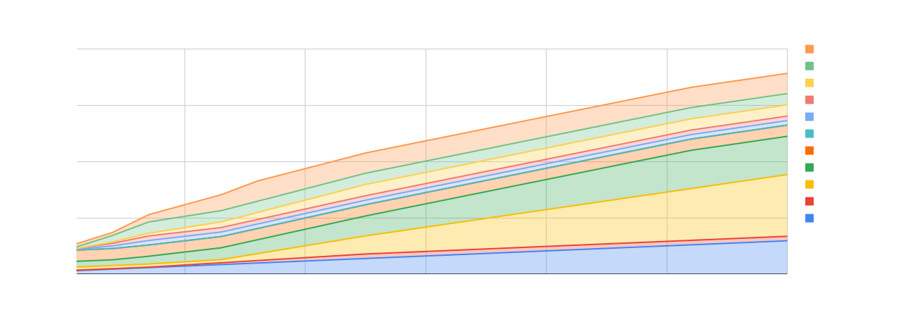
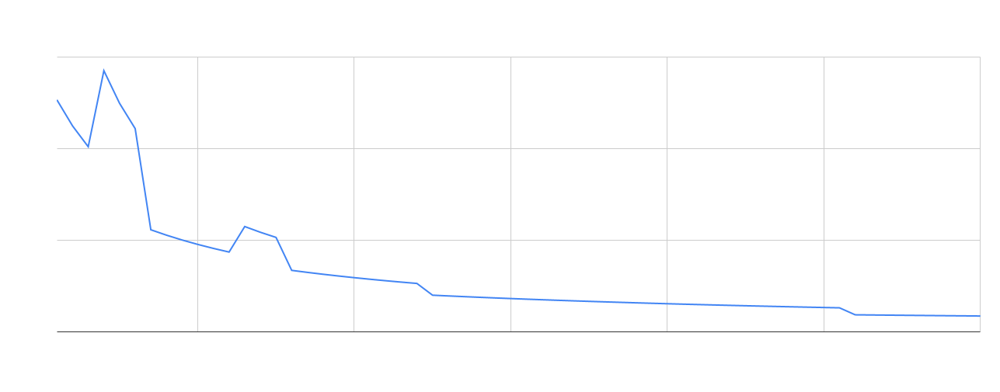
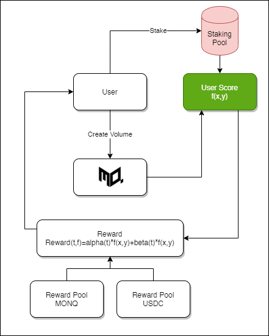

# Monoquant White Paper

## Table of Contents

1. [Abstract](#abstract)
2. [The Problem](#the-problem)
3. [The Solution: Monoquant](#the-solution-monoquant)
    - [Key Features](#key-features)
    - [Strategy Builder](#strategy-builder)
    - [Analysis](#analysis)
    - [Backtesting](#backtesting)
    - [Marketplace](#marketplace)
    - [Trading Terminal](#trading-terminal)
4. [Social](#social)
5. [Infrastructure](#infrastructure)
6. [Data](#data)
7. [MONQ Token](#monq-token)
    - [Tokenomics](#tokenomics)
    - [MONQ Vesting Schedule](#monq-vesting-schedule)
    - [Token Utility](#token-utility)
8. [Achievements](#achievements)
    - [Achievement Pool](#achievement-pool)
    - [General Quests](#general-quests)
    - [SocialFi Quests](#socialfi-quests)
    - [Payout Structure](#payout-structure)
    - [Seasonal Achievement Packs](#seasonal-achievement-packs)
    - [Exclusive NFT Rewards](#exclusive-nft-rewards)
    - [Understanding Reward Distribution Across Epochs](#understanding-reward-distribution-across-epochs)
    - [Reward Pattern](#reward-pattern)
    - [Total Reward Calculation](#total-reward-calculation)
    - [How It Works](#how-it-works)
    - [Example](#example)
9. [Staking](#staking)
    - [Staking System Overview](#staking-system-overview)
    - [User Score Calculation](#user-score-calculation)
    - [Reward Distribution](#reward-distribution)
    - [Balancing the Ecosystem](#balancing-the-ecosystem)
    - [Adjusting \( k' \)](#adjusting--k)
    - [Practical Implications](#practical-implications)
    - [How this works for Copy Trading](#how-this-works-for-copy-trading)
    - [How Users Benefit](#how-users-benefit)
10. [Team Formation and Dynamics](#team-formation-and-dynamics)
    - [Incentives for Team Collaboration](#incentives-for-team-collaboration)
    - [Role of Key Opinion Leaders (KOLs)](#role-of-key-opinion-leaders-kols)
    - [Funding and Reward Distribution](#funding-and-reward-distribution)
    - [Token Economics and Liquidity](#token-economics-and-liquidity)

---

## Abstract

Monoquant is a pioneering node-based no-code trading platform meticulously designed to democratize quantitative trading. In the rapidly evolving world of cryptocurrency trading, participants face an array of technological, operational, and educational barriers that hinder effective trading practices. Monoquant addresses the critical challenges faced by traders, including the use of outdated technology, the necessity of multi-disciplinary skills, and the prevalence of unverified trading strategies. By making advanced trading tools intuitively accessible, Monoquant empowers retail traders worldwide, enabling them to save time, enhance efficiency, and maximize profitability while providing liquidity to the general markets, making them more efficient for everyone.

We will become the platform where you can make all trading decisions on any data across every asset class globally.

The middleware between all data providers and exchanges, becoming the unreal engine of trading.

---

## The Problem

- **Outdated Technology and Tools:** Many existing trading platforms and tools do not meet modern standards, failing to provide the efficiency and accuracy needed for effective trading.
- **Complex Skill Requirements:** Traders must possess a wide array of skills ranging from data science and programming to advanced mathematics and machine learning, making the barrier to entry exceptionally high.
- **Navigational Challenges:** The vast number of data vendors, brokers, and trading interfaces make it difficult for traders to find optimal trading solutions.
- **Documentation and Data Management:** Often, traders encounter poorly maintained or outdated documentation and face challenges in data verification and cleansing.
- **Limited Customization:** Existing platforms offer minimal customization options. This rigidity forces traders to conform to predefined strategies and settings, hindering their ability to tailor approaches to their specific needs and market conditions. Ultimately, creating groups that trade the same strategies quickly destroys any strategy alpha.
- **Complex Proprietary Systems:** Platforms such as TradeStation and TradingView require users to learn complex proprietary languages to achieve any meaningful customization. This steep learning curve not only adds to the initial barrier of entry but also limits the trader's ability to quickly adapt to changing market dynamics.
- **Scalability and Verification Issues:** The market is flooded with unverified claims and strategies from numerous trading entities, making it difficult to identify trustworthy and effective trading methods.

This polarization in trading technology creates a gap in the market for a platform that balances ease of use with sophisticated customizable features without requiring users to master complex programming languages.

---

## The Solution: Monoquant  

### Key Features

#### Strategy Builder - No-Code Drag-and-Drop Interface

Our platform features a state-of-the-art node-based strategy builder that accelerates how trading strategies are created, refined, and executed. This intuitive no-code tool allows traders of all skill levels to construct and refine trading strategies.

**Features and Capabilities:**

- **User-Friendly Design:** Traders can build and modify their strategies using a drag-and-drop interface that is both intuitive and powerful, eliminating the need for programming knowledge.
- **Full Parameter Access:** Every underlying parameter is accessible, allowing users to tailor their strategies with as much simplicity or complexity as they desire.
- **Advanced Risk Management:** Take Profits, Trailing Take Profits, Scale-in and out, Trailing Stop Losses, Breakeven Stop Losses.
- **Access to Low-Level Trading Data:** Create unique data points to be used in strategy logic.
- **Turing Complete:** Can simulate any computational operations needed for trading strategies, offering infinite possibilities for strategy development.
- **AI Integration:** Over 10 ML model options available for selection with automated tuning of model parameters from a pool of over 5000 features.

#### Customizable Logic for Entries and Exits

- **Flexible Control:** Traders can design both the entry and exit points of their trades using customizable logic. This feature ensures that strategies align perfectly with traders’ risk tolerance and market outlook.

### Analysis

Advanced analytics for backtesting, paper trading, and live trading with over 80+ detailed metrics for comprehensive performance evaluation. Our analytical toolkit offers deep insights into trade execution and market behavior.

- **Millisecond Precision:** Track the exact millisecond of trade executions with intuitive labeling, ensuring precise timing analysis crucial for high-frequency trading strategies.
- **Data Visualization:** Every data point utilized is visualized, providing traders with clear insights into how they are generating alpha or where losses are occurring.

### Backtesting

Fully proprietary backtesting engine accurate to one millisecond with latency and slippage simulation based on the market at the time of data capture.

[See Understanding Backtesting Engine for more information. ](/general_docs/backtesting_engine/)

---

[Please view our roadmap, that details all features that are complete or coming soon.](/roadmap/)

---

## Social

Our platform integrates a sophisticated social engine designed to foster a transparent and interactive team-moderated trading community. This feature directly addresses the prevalent issue of scams and misinformation common in many online trading environments such as Telegram and Discord groups.

- **Trader Profiles:** Users can opt-in to display their trading performance publicly. This includes a comprehensive display of their success rates, strategies used, and overall profitability. Opting in allows users to essentially prove that they are a sophisticated trader worthy of receiving delegated stakes.
- **Building Trust:** As more traders opt-in to share their success and receive ratings, the platform becomes increasingly trustworthy and valuable to its users. This transparency creates a virtuous cycle where successful traders attract more followers, thereby enhancing their reputation further.
- **Reduced Scams:** By providing a clear and verifiable track record of trader performances, our platform significantly reduces the likelihood of scams, which are prevalent in less regulated communities.
- **Community Engagement:** The social engine encourages active participation and engagement, allowing users to learn from top performers, follow successful strategies, and improve their trading skills through community interaction.

---
## Infrastructure

- **Our base infrastructure is owned by us**, giving us the ability to provide the lowest latency and best execution with superior cost control.
- **Distributed globally at key points** with all the exchanges we are connected to.
- We collect, store, and analyze all of our own data on our own infrastructure in a high-performance data lake.
- Leverage a multi-cloud strategy with a common management tool set for both localized and cloud-based operations providing for seamless scalability for cloud-based execution when required.

---

## Data

- Our current data moat containing over 4T data points totaling around 1000 years of data.
- Our goal as we go forward is to acquire interesting datasets along with the teams behind them to provide fundamental data such as “Gas Price in California,” “Electricity Price in Texas,” “The Weather in Dubai,” “The Moon Phase” – any data that can be measured by time can affect any market. For instance, moon phase affects weather, which in turn can affect commodity prices and in turn S&P/Dow and BTC, etc.

---

## MONQ Token

The “Monq” token will become a foundation for enabling further development with partners, the platform, and the ecosystem as a whole. $Monq stands at the intersection of trading innovation and community rewards, fostering a trading environment where the community can benefit from the platform’s growth.

| Name               | Allocation (%) | Released at TGE (%) | (%) Total Supply Released @ TGE | Cliff (months) | Vesting (months) |
|--------------------|----------------|---------------------|---------------------------------|----------------|------------------|
| Achievement Pool   | 10.0%          | 10.0%               | 1.50%                           | 0              | 60               |
| Genesis Airdrop    | 2.0%           | 10.0%               | 0.20%                           | 6              | 6                |
| Team               | 28.0%          | 5.0%                | 1.40%                           | 12             | 48               |
| Company            | 17.0%          | 15.0%               | 2.55%                           | 3              | 48               |
| Initial Liquidity  | 5.0%           | 100.0%              | 5.0%                            | 0              | 0                |
| Future Liquidity   | 5.0%           | 0.0%                | 0.00%                           | 6              | 0                |
| KOL's              | 2.0%           | 16.7%               | 0.33%                           | 0              | 12               |
| Red Beard Ventures | 2.0%           | 16.7%               | 0.33%                           | 0              | 6                |
| Advisors           | 5.0%           | 0.0%                | 0.00%                           | 0              | 24               |
| Public Sale        | 5.0%           | 15.0%               | 0.75%                           | 0              | 0                |
| Seed Raise         | 9.0%           | 15.0%               | 1.35%                           | 3              | 12               |
| Future Raise       | 5.0%           | 0.0%                | 0.00%                           | 12             | 0                |

---

## Tokenomics

The MONQ token supply will be limited to one billion (1,000,000,000) with initial allocations for the following ecosystem contributors:

- Investors and early contributors
- Team and protocol developers
- Ecosystem and growth
- Advisors

---

## MONQ Vesting Schedule

Total token vesting stretches over 60 months (5 years), aiming to secure the protocol's long-term sustainability. At launch, there will be 13.42% (134,200,000) of total supply circulating.

---

## Token Utility

Our platform creates user participation through our token utility, driving volume and providing a secure environment to learn and follow Key Opinion Leaders (KOLs). The platform features an Achievement Rewards System that offers progressive rewards incentivizing engagement and skill development.

- **Volume Staking System:** Rewards users and teams based on their trading volume, supported by comprehensive risk management tools.
- **Encouraging Continuous Innovation:** Marketplace for trading strategies and AI models and fostering competition through sponsored trading events and side wagers enhancing visibility and community interaction.
- **Trading Competitions**: Users can participate in sponsored trading competitions created by other projects to showcase their skills and win rewards.
- **SocialFi Quests**: Users can complete quests on social media platforms to earn rewards and engage with the community.
- **Referral Program**: Users can refer friends to the platform and earn rewards.
---

## Quest Engine & Achievement Rewards

Our platform introduces an innovative Achievement and Quest Rewards System designed to incentivize user engagement and platform utilization through a series of progressive rewards. This system not only recognizes user milestones and expertise but also encourages competition, continuous learning, and adaptation to new market environments.

### Achievement Pool

Users will be rewarded from a dedicated "Achievement Pool," which is allocated specifically for recognizing and compensating users who reach significant milestones. Achievements such as "Generated $1M in Volume," "Created Your First AI Strategy," and "Utilized Multiple Timeframes in a Strategy" are examples of milestones that will trigger rewards.

### General Quests
Users within the platform can complete quests, quests are defined by the team, and can be specified on an Hourly, Daily, Weekly or Monthly Cycle
Examples of quests available are:
- Login to the Platform
- Run a Backtest
- 100K USDT Paper Volume on a single strategy
- Set a strategy open to copy trading!
- You used AI for the first time!
- You chatted with Monq LLM!
- Your Monastery has become a Temple! (Referred 50 Users)

### SocialFi Quests
- Within our Platform we have a fully built social questing system, for Twitter, Discord, Reddit and Youtube, any user can connect their account, create content, and be rewarded for it, all content is verified by our internal LLM and team.
- Users can submit social posts via either our Discord Bot, or directly within the platform.

Examples of SocialFi Quests:
- Tweet about your first strategy!
- Share your first strategy on Reddit!
- Create A Youtube Video about building a strategy!

### Payout Structure

The payout for each achievement is dynamically calculated based on the proportion of the Achievement Pool that has been utilized at the time of achievement.

- For instance: When 20% of the pool has been distributed, the payout for a new achievement will be calculated as Achievement Percentage x 0.9. This structure ensures a sustainable reward system that adjusts as more achievements are unlocked by the community.

### Seasonal Achievement Packs

To maintain engagement and introduce fresh challenges, we will release new "Achievement Packs" periodically, akin to seasons in video games. These packs will coincide with major updates or feature releases ensuring that the achievements evolve in line with the platform's capabilities and user interests.

### Exclusive NFT Rewards

In addition to monetary rewards, the first user to unlock a particular achievement will receive an exclusive NFT featuring unique artwork related to the achievement. This NFT acts as both a collectible and a mark of distinction, celebrating the user's pioneering spirit and expertise. Each NFT is one-of-a-kind, enhancing its value and desirability within our community. This will come with real-world assets (RWA) rewards also such as prizes from our partners. Partners such as exchanges will also be able to create sponsored achievements with prizes e.g., “Create $1M in Volume on x exchange.”

### Understanding Reward Distribution Across Epochs

In our system, we have a series of *n* achievement "epochs", each with its own set of rewards. The amount of rewards available in each epoch decreases according to a specific pattern.

---
## Reward Pattern

- The rewards for the first epoch are denoted as \( x_0 \).
- For each subsequent epoch, the rewards decrease by 10%. This means the rewards for the second epoch are \( 0.9 \times x_0 \), for the third epoch \( 0.9 \times \text{rewards of the second epoch} \), and so on.

This creates a geometric sequence for the rewards, where:

- **Epoch 1 Rewards:** \( x_0 \)
- **Epoch 2 Rewards:** \( 0.9 \times x_0 \)
- **Epoch 3 Rewards:** \( 0.9 \times 0.9 \times x_0 = 0.9^2 \times x_0 \)
- **Epoch *n* Rewards:** \( 0.9^{(n-1)} \times x_0 \)

### Total Reward Calculation
The total reward distributed across all *n* epochs is the sum of the rewards for each epoch, which can be calculated using the formula for the sum of a finite geometric series:

\[
\text{Total Reward} = x_0 \left( \frac{1 - 0.9^n}{1 - 0.9} \right)
\]

### Finding the Initial Reward \( x_0 \)
If we know the total reward to be distributed across all epochs, we can rearrange the formula to solve for \( x_0 \):

\[
x_0 = \text{Total Reward} \times \frac{1 - 0.9}{1 - 0.9^n}
\]

Where:

- **Total Reward** is the sum of rewards across all epochs.
- \( x_0 \) is the initial reward for the first epoch.
- \( n \) is the total number of epochs.

### How It Works
1. **Determine the total rewards** you want to distribute across all epochs.
2. Use the formula above to find \( x_0 \), the reward for the first epoch.
3. Distribute the rewards for each subsequent epoch based on the formula for a geometric sequence, reducing the reward by 10% each time.

### Example
If the total rewards for 5 epochs is 1000 units, to find the initial reward \( x_0 \):

1. Plug in the values into the formula:

\[
x_0 = 1000 \times \frac{1 - 0.9}{1 - 0.9^5}
\]

2. Calculate \( x_0 \), and then distribute the rewards accordingly for each epoch.

This way, we ensure a structured and predictable reward distribution that decreases gradually over the epochs.

---

## Staking

The Volume Staking system is strategically designed to boost engagement and active participation across our platform. By rewarding users and teams in proportion to the trading volume they generate alongside their stake, this system cultivates a dynamic and collaborative trading environment.

### Staking System Overview

The staking system is designed to reward users based on a dynamic "user score" rather than fixed tiers. This score is a function of both the volume generated by the user on the platform and the number of tokens they have staked. This approach provides a more flexible and equitable reward distribution, adapting to the contributions of each user.

### User Score Calculation

The user score is calculated using the formula:

\[
f(x, y) = a \cdot x + b \cdot y
\]

Where:

- \( x \) = Tokens staked by the user.
- \( y \) = Volume created by the user on the platform.
- \( a \) and \( b \) = Coefficients that determine the relative importance of staked tokens versus created volume. These coefficients can be static or variable, based on the needs of the platform.

For the current model, we define:

- \( a = \frac{\sum{x}}{\sum{x} + \sum{y}} \)
- \( b = \frac{\sum{y}}{\sum{x} + \sum{y}} \)

This ensures that the total user score across all users sums to 1, i.e.,:

\[
\sum f(\text{user}) = 1
\]

### Reward Distribution

Rewards are distributed to users in two categories:

1. **USDC/USDT Rewards**: Total amount denoted as \( \alpha \).
2. **MONQ Token Rewards**: Total amount denoted as \( \beta \).

For each time interval \( T \), the rewards are calculated as:

\[
\text{Reward}(T) = \alpha(T) + \beta(T)
\]

For individual users, rewards are calculated based on their score:

\[
\alpha(T_i) = f(x, y) \cdot \alpha(T)
\]

\[
\beta(T_i) = f(x, y) \cdot \beta(T)
\]

Thus, the total reward for a user at time \( T \) is:

\[
\text{Reward}(T, f) = \alpha(T) \cdot f(x, y) + \beta(T) \cdot f(x, y)
\]

This formula ensures that users who stake more tokens and create more volume receive a proportionally higher share of the rewards.

### Balancing the Ecosystem

The reward distribution must adapt to different scenarios to maintain economic stability:

1. **Low Volume and High Staking**: Common in the early stages. Rewards will favor volume creation to encourage trading activity.
2. **High Volume and Low Staking**: Indicates more active trading. Rewards will be adjusted to encourage more token staking.

To achieve this balance, we introduce a ratio \( k \):

\[
k = \frac{b}{a} = \frac{\text{Total Volume}}{\text{Total Tokens Staked}}
\]

And a fixed ratio \( k' \) that represents the desired balance:

- If \( k' > 1 \), volume creation is prioritized.
- If \( k' < 1 \), staking is prioritized.

#### Adjusting \( k' \)

The ratio \( k' \) is adjusted based on the ecosystem's economic needs:

- **Increase \( k' \) (>1)**: If there is low trading activity, increase rewards for volume creation to stimulate trading.
- **Decrease \( k' \) (<1)**: If there are few tokens staked, increase rewards for staking to incentivize token purchases and staking.

This dynamic adjustment continues until the protocol reaches maturity, aiming for \( k' = 1 \) to balance the rewards between staking and volume creation.

### Practical Implications

- **Staking Dominant**: If more users are staking with low trading activity, the system increases rewards for volume creation. This encourages stakers to start trading, benefiting the platform's liquidity and activity.
- **Volume Dominant**: If high trading activity occurs but few tokens are staked, staking rewards are increased. This attracts more users to stake their tokens, providing stability and lowering token supply volatility.

### How this works for Copy Trading
- The Copee will receive 10% of the volume revenue generated by the Copier.

### How Users Benefit
- **For Investors**: Users can stake tokens and earn rewards through an mDAO managed by a trader or team of their choice. This provides an opportunity for passive income while supporting the platform.

This staking model ensures a fair and adaptable reward system that aligns with the platform's goals and user contributions, maintaining a healthy and balanced ecosystem.

## Team Formation and Dynamics (mDAO)

Users have the opportunity to form or join teams by delegating a portion of their stakes to the DAO. This structure not only facilitates collective trading efforts but also empowers teams to self-govern. Teams can manage membership by retaining active members who contribute to the volume and removing those who do not. As teams generate more volume through their combined stakes, they can ascend through different tiers gaining increased visibility and prestige on the platform.

### Incentives for Team Collaboration

Joining teams like “AI Degen” allows members to leverage their delegated stakes to collectively increase trading volume, enhancing their rewards and the team's status. Teams function similarly to individual users but with the combined strength and strategic advantage of multiple traders. Teams have private social space on the website for discussions, sharing of ideas, trading logic, and such, creating a sense of exclusivity for the members of the team.

### Role of Key Opinion Leaders (KOLs)

Key Opinion Leaders (KOLs) play a pivotal role by forming their own teams and offering exclusive content. They can set a "Minimum Delegated Stake" for accessing their specialized analyses. This system is akin to a "Patreon" model but tailored for democratized trading, where access to premium content is gated by stake delegation, allowing KOLs to monetize their expertise while contributing to the platform's vibrancy and volume.

### Funding and Reward Distribution

Rewards within the Volume Staking system are derived from multiple sources to ensure stability and continual growth. These include:

- **Brokerage Fee Revenue:** A portion of the fees collected through our brokerage agreements with top cryptocurrency exchanges.
- **Automated DeFi Trading:** Fees generated from our token's involvement in automated decentralized finance (DeFi) trading strategies.
- **Competition Revenue:** Revenue generated from sponsored trading competitions, and the long term fund that is built from projects tokens that utilize our Volume and Quest Engine.

Payments to users are made using stablecoins such as USDT or USDC alongside our token, the distribution of which you can see in the below table. Upon receipt, these funds are utilized to purchase our platform's native token from the open market. This action not only rewards users directly but also supports buy-side liquidity for our token consistently.

---

## Token Economics and Liquidity

To further enhance the value of our native token, we implement a deflationary mechanism where 10% of the tokens bought back from the market are systematically burned. This reduces the overall token supply, potentially increasing the token’s value over time and providing additional incentives for users to participate actively in the platform.

---

## Continuous Liquidity and Market Support

An initial pool of tokens will be reserved to ensure there is always sufficient buy-side liquidity available. This setup supports a healthy trading ecosystem on our platform, encouraging more users to engage with our staking system without worrying about the liquidity of their rewards.

---