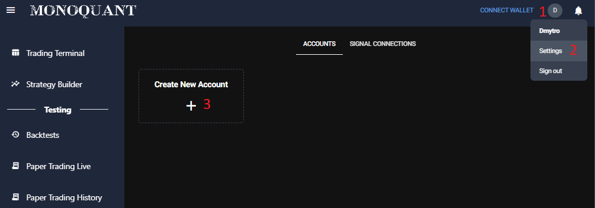
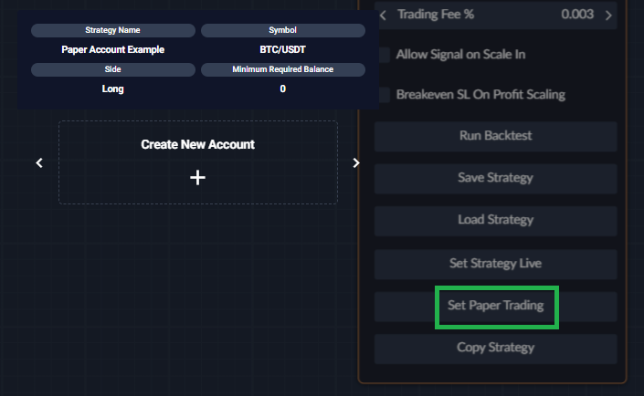

## Paper Trading Overview

Monoquant platform supports paper trading to give you an opportunity to forward test your strategy without putting
real money at stake, so you can get a better understanding about your strategy performance before you commit to it.

When you launch your strategy on your paper account, it will operate as if it was running on a real account. Your signals 
will be processed on real data from the exchange (prices, trades, orderbooks etc.). Also, if you want, you can receive 
notifications to a messenger of your choice to keep even a closer look at how your strategy performs or in case you want 
to try live executing the orders yourself.

_The main thing we **can not simulate** properly is the **delays** in processing your order on the exchange **during high load**._ 
While order execution often happens extremely quickly on most of the exchanges most of the time, during times of 
significant volatility (high load) exchanges often introduce delays and your orders take much longer to process. Such 
delays are not simulated, and it is always good to keep that in mind. 

### How to Start Paper Strategy
As soon as you are satisfied with your strategy in the backtests, setting your strategy live on Paper Account is just
a single click of a button at the bottom of the strategy details `Set Paper Trading`. You would only need to select (or
create) the Paper Account on which the strategy will run. The strategy will run on the exchange which was chosen in the
paper account exchange field. So, for example, if you tested your strategy on bybit-perpetual, and want to run paper 
strategy on bybit-perpetual, please, make sure to select paper account with bybit-perpetual set as exchange. 
Also, note that leverage will not be accessible on spot exchanges. 

### Your Paper Account
You can create your paper account either in your account settings:

1. 

2. 

Or directly in the strategy builder when you want to launch your paper strategy:

### Monitoring Your Strategy

#### Telegram
To receive notifications on Telegram you need to go -> Settings (top right) -> Signal Connections

* Strategy Signals - turn on to receive all signals your strategy generates
* Paper Trading - turn on to receive notifications about the actions (entries and exits) your strategy performs

#### Paper Trading Live
In the `Paper Trading Live` tab you can monitor your strategy live and also get full overview about the performance of
you strategy similar to what you would see in the backtesting results. 

