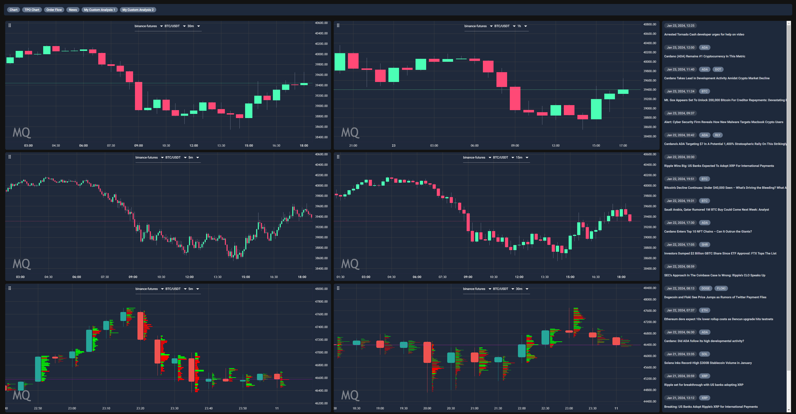

# Platform Roadmap

Our platform roadmap outlines a series of strategic releases designed to enhance functionality, expand data accessibility, and provide users with powerful trading tools. This roadmap is structured to roll out new features systematically, ensuring that each addition builds upon the last and aligns with our users' evolving needs.

## Platform Release
This outlines what is built right now, and ready to launch:

- **Strategy Builder**: The full strategy builder, with AI integration (11+ Models, with 4000+ features) and all advanced risk logic, along with over 130+ Indicators.
- **Backtesting**: Fully built out proprietary backtesting engine, accurate to 1ms.
- **Paper Trading**: Ability to launch strategies via paper trading, replicating our live engine and backtesting engine.
- **Analysis**: Over 80+ detailed metrics for analyzing and refining your strategies, with exportable logs for reporting.
- **Social Platform**: The ability to follow users, share strategies, post memes, and like posts.
- **Staking**: The ability to stake your tokens and earn rewards based on your volume.
- **Quest Engine**: The ability to complete quests on the Monoquant platform for rewards.
- **Live Signals via Telegram**: Receive all live signals via Telegram, including take profits and other advanced trading tools.

## Executor Release
- **Live Trade Execution**: Users will gain the ability to execute trades in real-time.
- **Multi-Exchange Execution**: Simultaneous live trading across multiple exchanges, enhancing arbitrage opportunities and market access.

## Copy Trading Release
- **Copy Trading**: Users can copy trade other users, KOLs, or teams.
- **Unique Payout Structure**: A unique payout structure that rewards the copied trader, the copier, and the platform, the copied trader will receive a percentage of the volume revenue generated by the copier.

## Scanner Release
- **Adaptive Market Scanner**: A tool that will allow you to deploy a strategy as a unique scanner, across multiple assets, giving real-time information, across multiple timeframes on 100 assets.

## Launchpad Release
- **Volume Generation**: A platform for other projects to launch their own self-service trading competitions on our platform.
- **Quest Engine**: Projects will also be able to use our quest engine to create unique challenges for users to complete for their project, on our platform, or across social media.

## Strategy Freedom Release
- **Treasury Management**: Monoquant will build general treasury management strategies, free for all users, projects, and institutions to use.
- **Market Making Strategies**: Monoquant will build general market making strategies, free for all users, projects, and institutions to use.

## Teams Release
- **Creation of mDAO Teams**: Users can create teams that function as mDAOs, allowing collaboration to generate volume, hunt achievements, or create unique strategies.
- **Ability to Delegate Stake**: Users can delegate a percentage of their stake to the team, contributing to the team's rewards.

## Multi-Asset Release
- **Cross-Asset Trading Strategies**: Ability to make trades on multiple assets based on other assets, enabling cross-asset arbitrage strategies.
- **Scanner**: Ability to scan multiple assets or entire markets for the specified logic.

## Portfolio Optimisation Release
- **Portfolio Optimisation**: Ability to optimise your portfolio based on your risk tolerance, goals, and market conditions.
- **Risk Management**: Advanced risk management tools to ensure your portfolio is protected from market volatility.
- **Asset Selection**: Use of our drag and drop interface to define the logic for universe selection, such as Twitter sentiment, TVL, exchange inflows.

## DeFi Release Stage 1
- **Signal-Based Trading**: Implementation of a system to accept trading signals, with functionality to sign and execute transactions directly within the interface.

## DeFi Release Stage 2
- **Automated DeFi Trading**: Enablement of fund delegation to a vault that autonomously executes trades across decentralized finance platforms.

## Marketplace for Trading Strategies & AI Models

The creation of a marketplace for intellectual property related to trading where users can buy and sell whole strategies or specific components of strategies.

- **Blocks of Logic:** Components or 'blocks' of trading logic such as specific algorithmic functions or decision-making trees can be traded between users.
- **AI Models:** Trained AI models on specific market data can be sold, allowing traders to leverage advanced predictive technologies in their own trading.
- **Trading Collections:** User-created “packages” of trading strategies and AI models configured to provide acquiring users with a diversified portfolio experience.
- **Market Dynamics:** This marketplace not only increases the utility and circulation of our token by requiring payments for transactions within it but also enhances collaborative innovation and sharing of best practices among platform users.

## Terminal Release
- **Enhanced Manual Execution**: Upgrade of the automated executor to allow manual interventions like setting infinite trailing stops and activating breakeven stops.
- **Multi Exchange Execution**: Simultaneous live trading across multiple exchanges and dex's, enhancing arbitrage opportunities and market access.
- **Expanded Data Streams**: Integration of live data feeds from Twitter, Reddit, and other social platforms.
- **Live Strategy Analysis**: Enable the strategy builder for monitoring and modifying strategies based on live market data.
- **Analytical Tools**: Tools to filter through assets and provide in-depth analysis about individual assets (heatmaps, orderbook volume, etc.) or market groups such as ingoing/outgoing funds into */USD groups.

- **Early Alpha Build of the Terminal**

## Dataset Release 1
- **DeFI Market Data**: Introduction of data from Uniswap, Pancakeswap, Jupyter, and Raydium.
- **Stable Coin Indexes**: Indexes of all buy & sell volume across supported exchanges.
- **Whole Market VWAP**: Whole market VWAP based on our data collection.

## Dataset Release 2
- **Tick Bars**: Support for tick bars in various increments (50, 100, 200, 250, 500, 1000, 10000, 100000).
- **Volume Bars**: Support for volume bars based on stable pairs (USDT/USDC/etc.) or fiat currencies (USD/EUR/GBP/USDC).

## Dataset Release 3
- **Comprehensive Market Data**: Extensive datasets covering stocks, indexes, options, and foreign exchange markets to support diverse trading strategies.

## Dataset Release 4
- **Macro and Micro Economic Indicators**: Includes interest rates, GDP, inflation, and earnings reports.
- **Consumer and Industry Specific Metrics**: Data such as dividend reports, Glassdoor reviews, unemployment rates, and food prices.
- **Commodity and Environmental Data**: Information on oil prices, the Big Mac index, global temperatures, renewable energies, and wheat prices.
- **Econometric Models**: Implementation of econometric models that can be used in the strategy builder.

## Dataset Release 5
- **Logistics and Natural Events**: Updates on ships in key canals, container ship activity, active storms, and other relevant data.
- **Miscellaneous Data**: Moon phases, horoscope periods, and NASA data to explore unconventional market influences.
- **US Government Trading Data**: Ability to trade based on US Senator trading data.

## Dataset Release 6
- **Onchain Analytics**: Ability to trade on data points such as total transactions, exchange balances, exchange inflows/outflows, fees paid per DEX, and pool liquidity.
- **DeFi Project Analytics**: TVL, number of developers, unlock schedule, treasury, FDV, yields.

## Side Wagers (Polymarket, but accurate with highly flexible options)

To offer a more personalized and risk-based engagement option, we introduce side wagers where users can create P2P wagers on market or general outcomes. They will be built using a reduced version of our no-code node-based strategy builder, allowing full flexibility to create serious or meme-worthy wagers.

- **Example Wager:** A user bets 100 USDT that BTC will exceed $1 million by 2025.
- **Example Wager:** A user bets 100 USDT that ETH will drop by 10% in the next 10 days.
- **Team Challenges:** Teams can place wagers against each other using advanced options, adding a layer of strategy and competition within the platform.
- **Fee Structure:** Wagers will incur a fee paid in our native token, aligning incentives and increasing token utility, along with Monoquant taking a percentage of the wager.