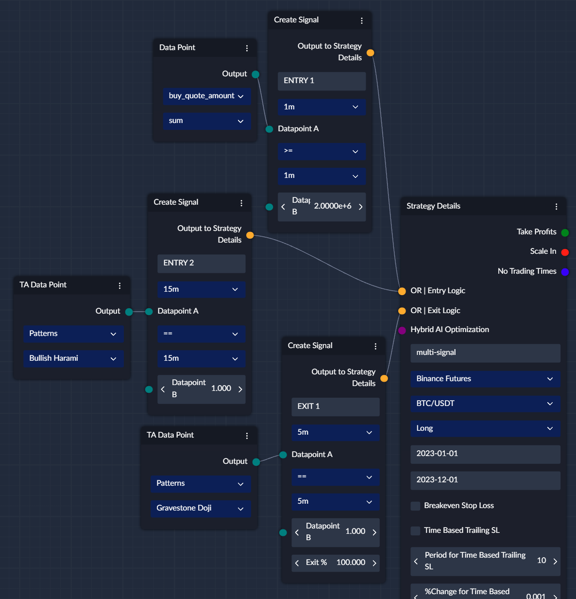

## What is the Create Signal Node?

- The `Create Signal` node allows you to create your Entry or Exit signals. 
- It accepts 1 or 2 Data nodes, allowing you to use both static and dynamic values.
- you need to choose one of the comparison operators and when your condition is met, the signal will be generated. 
- With grouping, you can create complex conditions by creating "AND" or "OR" conditions.
- When `Create Signal` is attached to `OR | Exit Logic` an additional field (`Exit %`) will become available to define the percentage of the position to exit when the condition is met.

## Comparisons
You can choose from the following comparison operators: >, <, >=, <=, !=, ==, Cross Over, Cross Under

* Datapoint A **>** _(greater than)_ Datapoint B
* Datapoint A **<** _(less than)_ Datapoint B
* Datapoint A **>=** _(greater than or equal)_ Datapoint B
* Datapoint A **<=** _(less than or equal)_ Datapoint B
* Datapoint A **==** _(is equal to)_ Datapoint B
* Datapoint A **!=** _(is not equal to)_ Datapoint B
* Datapoint A **Cross Over** _(in previous period A < B and in current A > B)_ Datapoint B
* Datapoint A **Cross Under** _(in previous period A > B and in current A < B)_ Datapoint B

!!! warning "Regarding RAW Data Points"
    **When using `raw` datapoints, it can only be compared to another `raw` on the same timeframe, other combinations, if they work, might produce unexpected results.**
    
    `raw` can also be compared to non-raw datapoints on the same tf without issues (they might even have different tfs, but that's also not recommended)

If you want to check if a pre-build Indicator or TA pattern was triggered, you need to compare it to 1 to check if it was
triggered, and to 0 to check if it wasn't triggered. Please, refer to the screenshot at the bottom for an example using
TA Data Points (ENTRY 2 and EXIT 1).

## Example
For example, for a very common trend trading strategies, you can use Cross Over / Cross Under operators to create your signals:

The Signals can only be generated on complete "candles" to avoid "False" or "re-painting" signals. In the above example, 
we are using 15m Time Frame, which means that signals could only be generated every 15 minutes of every hour (e.g. at :00, :15, :30, :45)

Lastly, you can attach multiple create signals to the Entry or Exit Logic and each of those signals will be evaluated separately.
In the below example, strategy will enter into a trade if ENTRY 1 or ENTRY 2 condition is satisfied, so either

* 1 minute candle had 2 million or more buy quote volume executed, OR
* Bullish Harami formation was seen on a 15m time frame
* Exit Logic is also defined in the same way, so the strategy will exit 100% of the position as defined by `Exit %` if the condition is met.

!!! note ""
    You can also see how you can group signals together on the [Signal Group](Signal_Group.md) page.