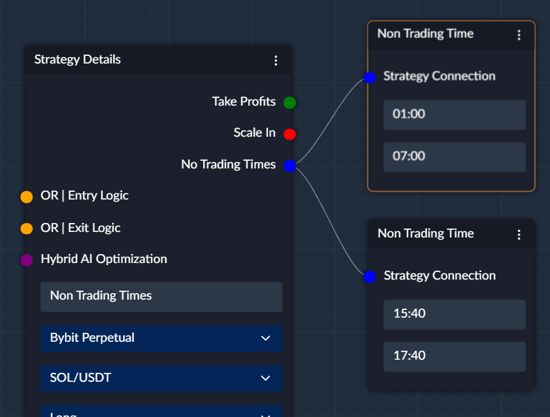

## Define the times when the strategy will not trade
The Non-Trading Times node allows you to define the times when the strategy will not trade. 
This can be useful if you want to avoid trading during certain times of the day, such as when the market is closed 
or when there is low liquidity.

## How to use the Non-Trading Times node
The times for the Non-Trading Times node are defined in the format `HH:MM`. The engine considers specified times to be 
in `UTC`. 

So for example, you might think that the volume is generally lower before the UK and the US sessions start, so
you can specify non-trading times as 01:00 - 07:00. Also, you might want to avoid trading around the close of the UK 
session, so you can specify 15:40 - 17:40.

