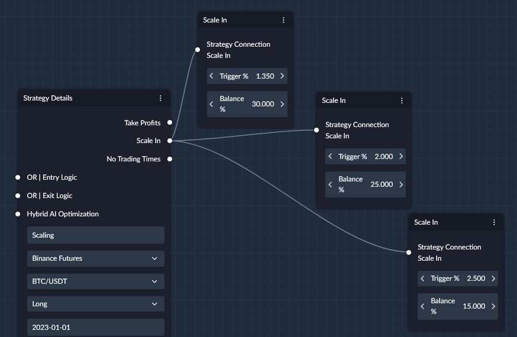

## What is Scale In Node?

The `Scale In` node allows you to define a rule to add pre-defined amount to your overall position when a pre-defined profit 
percentage of your existing position is met. 

On the below example, 

- We have added 3 `Scale In` nodes to our strategy, 
- Which will be activated once the profit percentage of our position reaches 1.35%, 2% and 2.5%. 
- When a `Scale In` is activated, a pre-defined percentage of the total balance will be added to the position. 

Suppose our total balance is 1,000$ and our position reaches 1.35% in profit
1. The `Scale In` will be activated.
2. We will add 300$ or 30% of our balance to our position. 

!!! note "Important"
    - Keep in mind that the `entry price` that the strategy position has is a `volume weighted average price (VWAP)`
    - New additions to the position that happened at a price different from the original entry price will move the entry price. 
    - When `Scale In` is triggered, your original entry price will change, and so the target for your further `Scale In`'s is going to adjust accordingly. 

