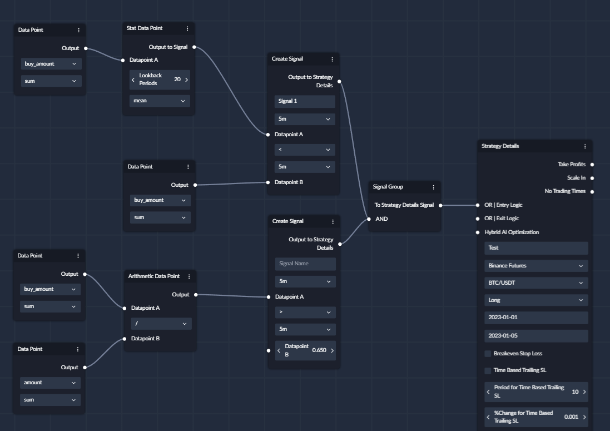

## What is a Signal Group Node?

With `Signal Group` you can turn your good signals into great signals by adding additional confirmations to them. 

- `Signal Group` Nodes allows you to combine multiple [Create Signals](Create_Signal.md) together to create one signal out of them all.
- `Signal Group` is attached to `OR | Entry Logic` or `OR | Exit Logic` of the [Strategy Details](Strategy_Details.md).
- `Signal Group` will only generate a signal when every signal within a Signal Group is triggered. 
- `Signal Group` can be used to create complex conditions by creating "AND" conditions.

You can also keep using ordinary Create Signals along with Signal Groups, or multiple Signal Groups giving you **_infinite_** possibilities 

---
## Example

Here is an example with one signal being a simple moving average crossover and another signal checking if 
buy volume is bigger than the sell volume to confirm that the demand at the given candle is stronger than supply. 

Signal Group accepts [Create Signals](Create_Signal.md) with different Time Frames, but it's important to remember
that this would only produce composite signals when **ALL** Create Signals produce a signal. 

!!! warning "Important"
    Signals in your chosen time frames must align by time.

Let's consider a Signal Group that received signals with these time frames: 3m, 5m and 30m.

The below table shows how frequently each signal might be created, and the grouped signal for the chosen time frames 
could only be triggered at :30m and :00m of every hour because these are the only times when all time frames align together.

### Mixed TF signal 
| **3m** | **5m** | **30m** |   Signal?   |
|:------:|:------:|:-------:|:-----------:|
|  :03   |   -    |    -    |      No     |
|   -    |  :05   |    -    |      No     |
|  :06   |   -    |    -    |      No     |
|  :09   |   -    |    -    |      No     |
|   -    |  :10   |    -    |      No     |
|  :12   |   -    |    -    |      No     |
|  :15   |  :15   |    -    |      No     |
|  :18   |   -    |    -    |      No     |
|   -    |  :20   |    -    |      No     |
|  :21   |   -    |    -    |      No     |
|  :24   |   -    |    -    |      No     |
|   -    |  :25   |    -    |      No     |
|  :27   |   -    |    -    |      No     |
|  **:30**   |  **:30**   |   **:30**   | **Signal!!** |
|  :33   |   -    |    -    |     No      |

As you can see in the below image, you can group signals together by connecting them to a `Signal Group` node, and then connecting the `Signal Group` node to the `Entry` or `Exit` input on the strategy details node.

You can also connect individual `Create Signal` nodes directly to the `Entry` or `Exit` input on the strategy details node, to create `OR` conditions.

You can also combine `AND` and `OR` conditions to create even more complex conditions.

## Ranges
You can create ranges by using multiple `Create Signal` nodes and connecting them to a `Signal Group` node.

For example below, I have defined a range to enter a trade when RSI is between 30 and 70.

