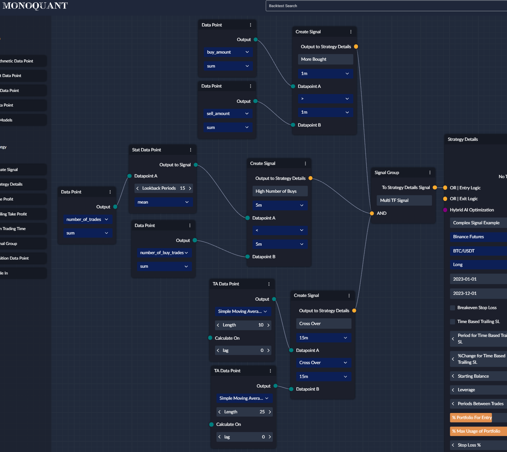
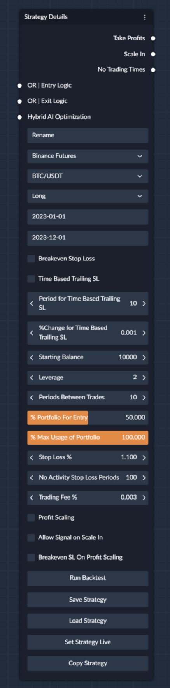

## Overview 

The Strategy details node is the main node in the strategy, it is where all of your nodes terminate, and where you can 
dial in your risk levels with the additional settings.

## Node Connections
Nodes are connected to the Strategy Details node in the following ways

### Take Profits
You can attach as many take profits to the strategy as you like, these will be triggered when the conditions specified 
per take profit are met, you can have unlimited take profits, the limit is the minimum order size of the exchange, and 
the % you are exiting.

!!! warning "Important"

    Take profits will only ever be allowed to add upto 100%, for example, if you have 3 takes profit nodes attached to 
    the strategy details node, and they are set to exit 25%, 50% and 75%, the last node to be triggered (75%) would 
    only exit 25%, due to there only being 25% of the position left to exit.

### Scale In
You can also attach as many scale ins to the strategy as you like, these will be triggered when the conditions 
specified per scale in are met, you can have unlimited scale ins, the limit is the minimum order size of the exchange, 
and the % you are entering.

### No Trading Times
You can attach as many no trading times to the strategy as you like, these will stop the strategy trading, during the 
hours you specify, you can have unlimited non trading times

### OR | Entry Logic
This is where you can attach either a `Create Signal` or a `Signal Group` node, these will be evaluated to determine if 
the strategy should enter a trade or increase your current position, this behaviour can also be modified by the 
`Strategy Details` , you can have unlimited nodes attached to the `OR | Entry Logic` node.

### OR | Exit Logic
This is where you can attach either a `Create Signal` or a `Signal Group` node, these will be evaluated to determine 
if the strategy should reduce the amount held in a position, you can have unlimited nodes attached to the 
`OR | Entry Logic` node.

### Hybrid AI Optimization
This is where you can attach a `Hybrid AI Optimization` node, this will allow you to optimize your strategy using AI, 
you can only have one attached to the `Hybrid AI Optimization` connection.

Ultimately, after you define your AI settings, we perform the following steps:

1. We run the strategy with the default settings (NO AI Training)
2. We use the outcome of trades to label the dataset.
3. We train the AI model on the labeled dataset, aiming to predict the outcome of trades, aiming to reduce the number 
   of losing trades taken.
4. We run the strategy with the AI model, and compare the results to the default strategy.

### Compute Method

Compute Method defines how your signals are going to be processed for backtesting, paper trading and for live trading.
This option is important for when your signal is based on multiple different time frames simultaneously. You have 2 
options here:

1. **compute_on_min_timeframe** - all individual signals are going to be converted to the smallest time frame for that
   specific signal. Usually this will produce more signals. 

2. **compute_on_max_timeframe** - all individual signals are going to be converted to the highest time frame for that 
   specific signal. Usually this will produce fewer signals.

Suppose the following example:

To compute on min tf we wait for the smallest TF candles to close after which we check if the condition could be 
satisfied and triggered. Conditions on higher time frames are staying True after they've been triggered for the duration
of the whole higher TF period on the smallest TF. So for example, in case of 1m and 15m TF, if the condition on 15m
was satisfied in the candle that closed at 00:15, then that condition on 15m will stay True since 00:15 till 00:29 on 
1m TF. After Signal is Triggered, entry happens at the next candle open. Below is an example table:

#### compute_on_min_tf
| time  |  1m   |  5m   |  15m  | Signal Triggered | Entry |
|:------|:-----:|:-----:|:-----:|:----------------:|-------|
| 00:01 | True  | False | False |      False       | False |
| 00:02 | True  | False | False |      False       | False |
| 00:03 | False | False | False |      False       | False |
| 00:04 | False | False | False |      False       | False |
| 00:05 | False | False | False |      False       | False |
| 00:06 | False | False | False |      False       | False |
| 00:07 | True  | False | False |      False       | False |
| 00:08 | False | False | False |      False       | False |
| 00:09 | False | False | False |      False       | False |
| 00:10 | False | True  | False |      False       | False |
| 00:11 | True  | True  | False |      False       | False |
| 00:12 | True  | True  | False |      False       | False |
| 00:13 | False | True  | False |      False       | False |
| 00:14 | False | True  | False |      False       | False |
| 00:15 | False | True  | True  |      False       | False |
| 00:16 | False | True  | True  |      False       | False |
| 00:17 | False | True  | True  |      False       | False |
| 00:18 | True  | True  | True  |     **True**     | False |
| 00:19 | False | True  | True  |      False       | True  |
| 00:20 | False | True  | True  |      False       | False |
| 00:21 | False | True  | True  |      False       | False |
| 00:22 | False | True  | True  |      False       | False |
| 00:23 | False | True  | True  |      False       | False |
| 00:24 | True  | True  | True  |     **True**     | False |
| 00:25 | False | True  | True  |      False       | True  |
| 00:26 | False | False | True  |      False       | False |
| 00:27 | False | False | True  |      False       | False |
| 00:28 | False | False | True  |      False       | False |
| 00:29 | False | False | True  |      False       | False |
| 00:30 | False | True  | False |      False       | False |
| 00:31 | True  | True  | False |      False       | False |
| 00:32 | False | True  | False |      False       | False |
| 00:33 | False | True  | False |      False       | False |
| 00:34 | False | True  | False |      False       | False |
| 00:35 | False | True  | False |      False       | False |
| 00:36 | False | False | False |      False       | False |

In case of computing the signals on the max TF from the available TFs in the Signal Group, we would bring all smaller TF
signals to the highest TF which in our example is 15m. Meaning Signal Group could be triggered only every 15m. Signals 
on the smaller TFs would be considered satisfied if at least one time during the 15m period they were triggered. The
above table from the compute_on_min_tf would turn into the below table:

#### compute_on_max_tf
| time  |  1m   |  5m  |  15m  | Signal Triggered | Entry |
|:------|:-----:|:----:|:-----:|:----------------:|-------|
| 00:00 | True  | True | False |      False       | False |
| 00:15 | True  | True | True  |       True       | False |
| 00:30 | True  | True | False |      False       | True  |

Using compute_on_min_tf, we would have entry signals at 00:19 and 00:25 while using compute_on_max_tf, we would enter 
only at 00:30.

---
## Inputs

| Name                                |   Type   |                                                                                                   Description                                                                                                   |
|-------------------------------------|:--------:|:---------------------------------------------------------------------------------------------------------------------------------------------------------------------------------------------------------------:|
| Name                                |  String  |                                                                 What to name your strategy, this name should be unique amongst your strategies                                                                  |
| Exchange                            | Dropdown |                                                                        Which exchange you want to backtest on/run your strategy live on                                                                         |
| Side                                | Dropdown |                                                                                Whether you are running a short or long strategy                                                                                 |
| Backtest Start Date                 |  String  |                                                            This is the date to backtest from, should be in YYYY-MM-DD format or YYYY-MM-DD HH:MM:SS                                                             |
| Backtest End Date                   |  String  |                                                            This is the date to backtest from, should be in YYYY-MM-DD format or YYYY-MM-DD HH:MM:SS                                                             |
| Breakeven Stop Loss                 | Checkbox |            When ticked, it will be activated upon any type of non-full exit, e.g. if you exit 30% of the position at 1% profit, it will then place a stop loss at your `Average Entry Price + Fees`             |
| Time Based Trailing SL              | Checkbox |                                                                  When ticked, will use the following two settings to decrease your Stop Loss %                                                                  |
| Period for Time based Trailing Stop | Integer  |                                                               Number of periods `(Lowest TF * Periods)` between each reduction of the Stop Loss %                                                               |
| %Change for Time Based Trailing SL  |  Float   |                                       Amount to decrease the Stop Loss % by,  e.g. If your Stop Loss % is 0.5% and your %Change is 0.1% the next value would be 0.4%                                        |
| Starting Balance                    | Integer  |                                                                                       Simulated balance for your backtest                                                                                       |
| Leverage                            | Integer  |                                                       The amount of Leverage to use (Only works where leverage can be used, otherwise it will be ignored)                                                       |
| Periods Between Trades              | Integer  |                The number of periods to wait `(Lowest TF * Periods)` between taking another action, So if you get another signal between this time has passed, then that signal will be ignored                 |
| % Portfolio for Entry               | Integer  |                                                                        The amount of your available balance to commit to a single entry                                                                         |
| % Max usage of Portfolio            | Integer  |                                                                           The total amount of your available balance that can be used                                                                           |
| Stop Loss %                         | Integer  |                                                                         Stop Loss % of the trade (Calculated from Average Entry Price)                                                                          |
| No Activity Stop Loss Periods       | Integer  |                                   The number of periods `(Lowest TF * Periods)` to wait to exit the position, if there has been no signals, or take profits or scale in's etc                                   |
| Trading Fee %                       | Integer  |                                                                        The Trading Fee % Which this particular exchange is charging YOU                                                                         |
| Profit Scaling                      | Integer  |                                                                    Whether to enable Profit Scaling (You must have Scale in nodes connected)                                                                    |
| Allow Signal on Scale in            | Integer  | When Ticked additional signals (entry logic) could be acted upon despite scale in logic is used, otherwise only first signal (entry logic) is allowed, and only scale in will increase the size of the position |
| Breakeven SL On Profit Scaling      | Integer  |   Whether to activate Breakeven SL after a profit scale in, for example, if you scale in at 0.5% profit, your average entry price would increase by 0.25% and thus with it unticked it could immediately exit   |
| Run Backtest                        | Integer  |                                                                                                Run the backtest                                                                                                 |
| Save Strategy                       | Integer  |                                                                                                Save the strategy                                                                                                |
| Load Strategy                       | Integer  |                                                                                                Load the Strategy                                                                                                |
| Set Strategy Live                   | Integer  |                                                                                       Set the strategy live (Coming soon)                                                                                       |
