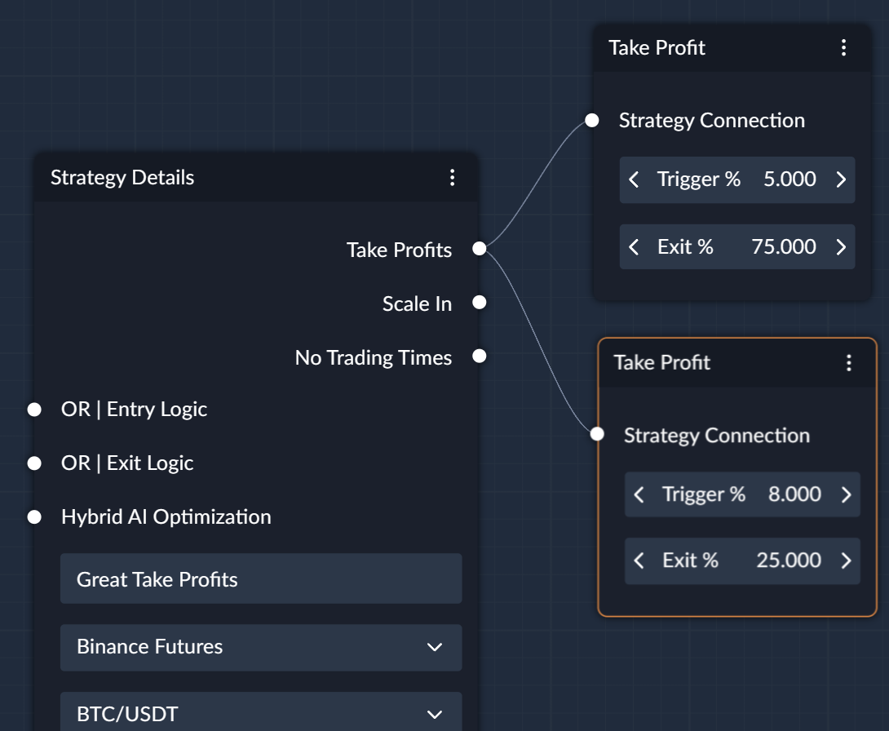

## What is the `Take Profit` Node?

- `Take Profit` nodes can be used to close a portion of the position or the entire position.
- You can have infinite `Take Profit` nodes attached to the `Strategy Details` node.
- Each `Take Profit` node can have different conditions and percentages to close the position.

---

{align="right" width="450"}

### Trigger %
Distance from the `volume weighted average entry price` at which to trigger close order

### Exit % 
Percentage of the `maximum` recorded position value to close when **trigger %** is reached

 

---

!!! info "Exit Percentages"
    Exit % among the Take Profits you create does not necessarily need to sum to 100. 
    
    If you have complex logic with multiple take profits, [Trailing Take Profits](Trailing_Take_Profit.md) and Exit [Create Signals](Create_Signal.md), the position
    portions will be closed as soon as the requirements for "closing" action is met. 

### Example
1. You have 2 take profits that both close 50% of the position
2. You also have an `Exit Signal` that closes 50% of the position

Then:

- `Exit Signal` is executed first closing 50% of the position, 
- Then the take profit is triggered, it would close the remaining 50% of the position.
