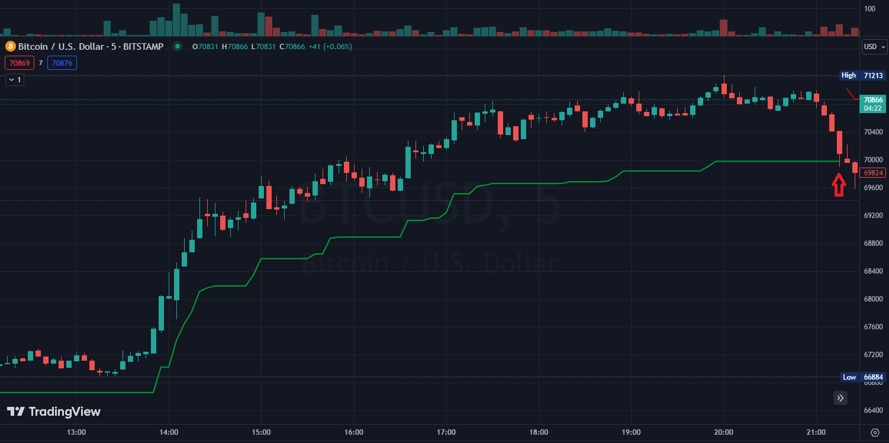
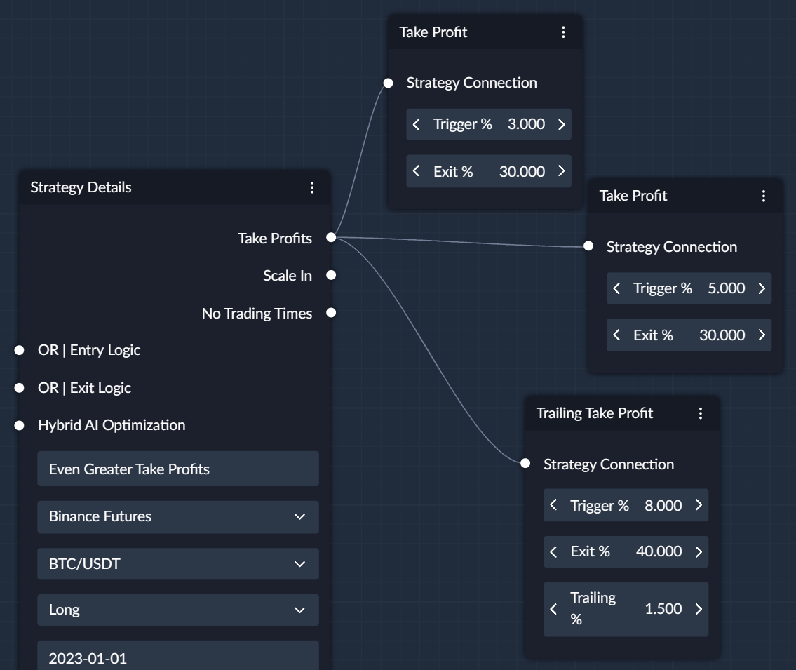

## What is a Trailing Take Profit Node?
- `Trailing Take Profit` nodes can be used to close a portion of the position or the entire position.
- Unlike The [Take Profit](Take_Profit.md) Node, `Trigger %` in a Trailing Take Profit activates the trailing rather than instantly executing an exit order.

## How a Trailing Take Profit Works
Below is an illustration of how a trailing take profit would follow the price in a Long trade after it's activation 
with a 1.5% `Trailing %` value. 

- It uses the highest seen price (lowest seen for a Short Trade) to adjust where the closing order should be executed.
- On the candle with a red arrow underneath a closing order would've been executed

## Example
In the below image, after the price reaches the target of 8% (`Trigger %`) of a favourable price change:

- The system creates a new target price `Trailing %` away from the price which was used to activate the trailing take profit. 
- As soon as the price reverses back by `Trailing %`, the exit order for the pre-defined `Exit %` (40%) will be executed.

